# Azure Fundamentals AZ-900

## Learning Path 1: Describe Cloud Concepts

The certification validates your basic knowledge of cloud services and how those services are provided with Azure.

### Module 1: Describe Cloud Computing

This module introduces you to cloud computing. It covers things such as cloud concepts, deployment models, and understanding shared responsibility in the cloud.

#### Introduction To Cloud Computing

You'll dive into concepts like ***shared responsibility***, different ***cloud models***, and explore the ***unique pricing method*** for the cloud.

##### What is cloud computing?

***Cloud computing*** is the delivery of computing services ***over the internet***, it doesn’t have to be constrained by physical infrastructure the same way that a traditional datacenter is.

1. ***Compute Power***: How much processing your computer can do.
2. ***Storage***: How much data your computer can hold.

##### Describe The Shared Responsibility Model

The shared responsibility model is heavily tied into the cloud service types: ***infrastructure*** as a service ***(IaaS)***, ***platform*** as a service ***(PaaS)***, and ***software*** as a service ***(SaaS)***.

1. ***IaaS*** places the most responsibility on the consumer, with the cloud provider being responsible for the basics of ***physical security, power, and connectivity***.
2. ***SaaS*** places most of the responsibility with the ***cloud provider***.
3. ***PaaS***, being a ***middle ground*** between ***IaaS*** and ***SaaS***.

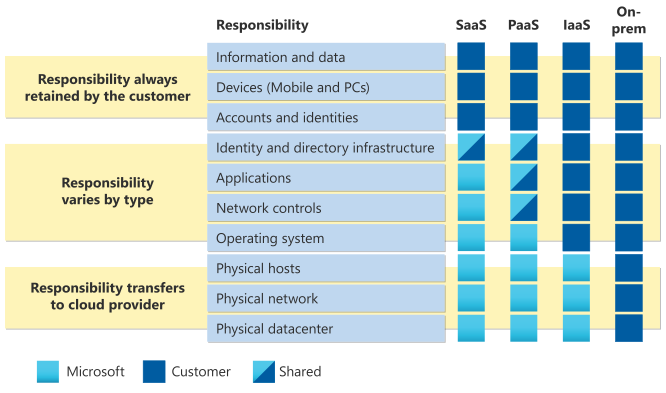

#### Define Cloud Models

The ***cloud models*** define the deployment type of cloud resources. The three main ***cloud models*** are:

1. ***private***
2. ***public***
3. ***hybrid***

##### Private Cloud

***Private cloud*** provides much greater control for the company and its IT department. However, it also comes with ***greater cost*** and ***fewer*** of the benefits of a public cloud deployment.

##### Public Cloud

A ***public cloud*** is built, controlled, and maintained by a ***third-party cloud provider***. With a public cloud, anyone that wants to purchase cloud services can access and use resources.

##### Hybrid Cloud

A hybrid cloud environment can be used to ***allow a private cloud*** to surge for increased, temporary demand by deploying ***public cloud resources***.

##### Multi-cloud

In a ***multi-cloud*** scenario, you use ***multiple*** public cloud providers. Maybe you use different features from different ***cloud providers***. Or maybe you started your cloud journey with one provider and are in the ***process of migrating*** to a different provider.

##### Azure Arc

***Azure Arc*** can help manage your ***cloud environment***, whether it's a ***public cloud*** solely on Azure, a ***private cloud*** in your datacenter, a ***hybrid configuration***, or even a ***multi-cloud environment*** running on multiple cloud providers at once.

##### Azure VMware Solution

***Azure VMware*** Solution lets you run your VMware workloads in Azure with seamless ***integration and scalability***.

#### Describe The Consumption-Based Model

***Capital expenditure (CapEx)*** is typically a ***one-time***, up-front expenditure to purchase or secure tangible resources. In contrast, ***operational expenditure (OpEx)*** is spending money on services or products ***over time***.

***Cloud computing*** falls under ***OpEx*** because cloud computing operates on a ***consumption-based model***. Instead, ***you pay for the IT resources you use***.

##### Compare Cloud Pricing Models

***Cloud computing*** is the delivery of computing services over the internet by using a ***pay-as-you-go pricing model***.

- ***Plan and manage*** your operating ***costs***.
- ***Run*** your infrastructure ***more efficiently***.
- ***Scale*** as your business ***needs change***.

Instead of maintaining CPUs and storage in your datacenter, you rent them for the time that you need them.

### Module 2: Describe The Benefits Of Using Cloud Services

This module introduces you to the benefits ***cloud computing*** can offer you or your organization.

#### Describe The Benefits Of High Availability And Scalability In The Cloud

When building or deploying a cloud application, two of the biggest considerations are ***uptime (or availability)*** and the ability to ***handle demand (or scale)***.

##### High Availability

***High availability*** focuses on ensuring ***maximum availability***, regardless of disruptions or events that may occur.

***Service Level Agreements (SLAs)*** are a key component of ***high availability***. An SLA is a ***contract between a service provider and a customer*** that defines the level of service expected from the service provider.

##### Scalability

***Scalability*** refers to the ***ability to adjust resources*** to meet demand.

***Scaling*** generally comes in two varieties: ***vertical and horizontal***.

- ***Vertical scaling*** means increasing or decreasing the ***size*** of a ***virtual machine***.

- ***Horizontal scaling*** means increasing or decreasing the ***number of virtual machines***.

***Elasticity*** refers to the ability to scale resources as needed, to ensure that an application can keep up with demand, and then reducing the available resources during off-peak hours.

#### Describe The Benefits Of Reliability And Predictable In The Cloud

***Reliability and predictability*** are two crucial cloud benefits that help you develop solutions with confidence.

##### Reliability

***Reliability*** is the ability of a system to ***recover from failures*** and ***continue to function***.

With a decentralized design, the cloud enables you to have resources deployed in regions around the world.

##### Predictability

***Predictability*** can be focused on ***performance predictability*** or ***cost predictability***.

##### Performance

***Performance predictability*** focuses on predicting the ***resources needed*** to deliver a ***positive experience*** for your customers.

***Autoscaling, load balancing, and high availability*** are just some of the cloud concepts that support performance predictability.

##### Cost

***Cost predictability*** is focused on predicting or forecasting the ***cost of the cloud spend***.

By operating in the cloud and using cloud analytics and information, you can predict future costs and adjust your resources as needed.

#### Describe The Benefits Of Security And Governance In The Cloud

***Cloud-based auditing*** helps flag any resource that’s ***out*** of compliance with your corporate standards and provides mitigation strategies.

If you want ***maximum control*** of security, ***infrastructure as a service*** provides you with physical resources but lets you manage the ***operating systems*** and ***installed software***, including patches and maintenance.

If you want patches and maintenance taken care of automatically, ***platform as a service or software as a service*** deployments may be the best cloud strategies for you.

##### Describe The Benefits Of Manageability In The Cloud

A major benefit of ***cloud computing*** is the ***manageability*** options.

#### Management Of The Cloud

***Management of the cloud*** speaks to managing your ***cloud resources***.

- ***Automatically scale*** resource deployment based on need.
- Deploy resources based on a ***pre-configured template***, removing the need for manual configuration.
- ***Monitor*** the health of resources and automatically replace failing resources.
- ***Receive automatic alerts*** based on configured metrics, so you’re aware of performance in real time.

##### Management In The Cloud

***Management in the cloud*** speaks to ***how you’re able to manage*** your cloud environment and resources.

- Through a ***web portal***.
- Using a ***command line interface (CLI)***.
- Using ***APIs***.
- Using ***PowerShell***.

### Module 3: Describe Cloud Service Type

This module covers the different ***cloud service types*** and shares some of the use cases and benefits aligned with each service type.

#### Describe Infrastructure As A Service (IaaS)

With ***IaaS***, you’re essentially ***renting the hardware in a cloud datacenter***, but what you do with that hardware is ***up to you***.

##### IaaS Shared Responsibility Model

The ***cloud provider*** is responsible for ***maintaining the physical infrastructure and its access to the internet***.
You’re responsible for ***installation and configuration, patching and updates, and security***.

##### IaaS Scenarios

- ***Lift-and-shift migration***: You’re standing up cloud resources similar to your on-prem datacenter, and then simply moving the things running on-prem to running on the IaaS infrastructure.
- ***Testing and development***: You have established configurations for development and test environments that you need to rapidly replicate.

#### Describe Platform As A Service (PaaS)

***Platform as a service (PaaS)*** is a ***middle ground*** between renting space in a datacenter (***infrastructure as a service***) and paying for a complete and deployed solution (***software as a service***).

##### PaaS Shared Responsibility Model

The ***cloud provider*** is responsible for ***maintaining the physical infrastructure and its access to the internet***, just like in IaaS. In the PaaS model, the cloud provider will also ***maintain the operating systems, databases, and development tools***.

##### PaaS Scenarios

- ***Development framework***: PaaS provides a framework that developers can build upon to develop or customize cloud-based applications.
- ***Analytics or business intelligence***: Tools provided as a service with PaaS allow organizations to analyze and mine their data, finding insights and patterns and predicting outcomes to improve forecasting, product design decisions, investment returns, and other business decisions.

#### Describe Software As A Service (SaaS)

***Software as a service (SaaS)*** is the most complete cloud service model from a product perspective. With ***SaaS***, you’re essentially ***renting or using a fully developed application***.

##### SaaS Shared Responsibility Model

In a SaaS environment you’re responsible for the ***data that you put into the system, the devices that you allow to connect to the system, and the users that have access***.

The cloud provider is responsible for ***physical security of the datacenters, power, network connectivity, and application development and patching***.

##### SaaS Scenarios

- ***Email*** and ***messaging***.
- ***Business productivity applications***.
- ***Finance*** and ***expense*** tracking.

## Learning Path 2: Describe Azure Architecture And Services

This learning path explores Microsoft Azure, its architecture, and some of the most commonly used services and resources.

### Module 1: Describe The Core Architectural Components Of Azure

You'll learn about the ***physical infrastructure***, how resources are managed, and have a chance to create an ***Azure resource***.

#### What Is Azure?

Azure is a continually expanding set of cloud services that help you meet current and future business challenges.

##### What Does Azure Offer?

1. Continuous innovation
2. Commitment to open source
3. Hybrid Cloud Solutions
4. Security and Compliance

#### Get Started With Azure Accounts

1. To create and use ***Azure services***, you need an ***Azure subscription***.
2. After you've created an ***Azure account***, you're free to create additional subscriptions.
3. After you've created an ***Azure subscription***, you can start creating ***Azure resources*** within each subscription.

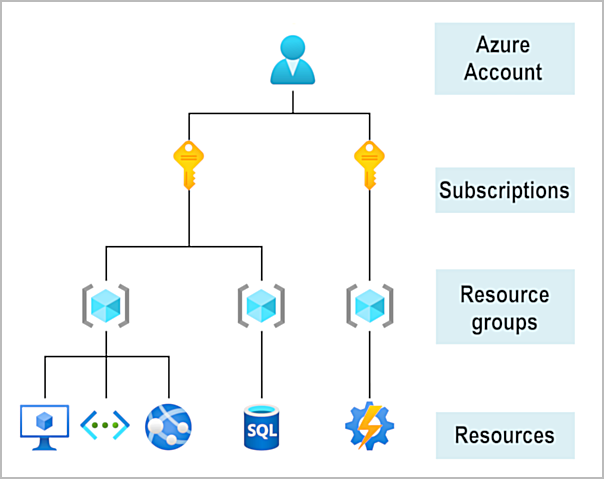

#### Describe Azure Physical Infrastructure

The ***core*** architectural components of Azure may be broken down into two main groupings: the ***physical infrastructure***, and the ***management infrastructure***.

##### Physical Infrastructure

***Datacenters*** are facilities with ***resources*** arranged in racks, with dedicated ***power, cooling, and networking*** infrastructure.

1. ***Regions***: Geographical area on the planet that contains ***at least one***, but potentially multiple ***datacenters*** that are nearby and networked together with a ***low-latency*** network.
2. ***Availability zones***: Physically ***separate datacenters*** within an ***Azure region***. An ***availability zone*** is set up to be an isolation boundary. If one zone goes ***down***, the other continues ***working***.

Azure services that support availability zones fall into three categories:

1. ***Zonal services***: You pin the resource to a ***specific zone*** (for example, VMs, managed disks, IP addresses).
2. Zone-redundant services: The platform ***replicates*** automatically across zones (for example, zone-redundant storage, SQL Database).
3. ***Non-regional services***: Services are ***always available*** from Azure geographies and are ***resilient*** to zone-wide outages as well as region-wide outages.

##### Region Pairs

Because the ***pair of regions*** are directly connected and far enough apart to be isolated from regional disasters, you can use them to provide ***reliable services*** and ***data redundancy***.

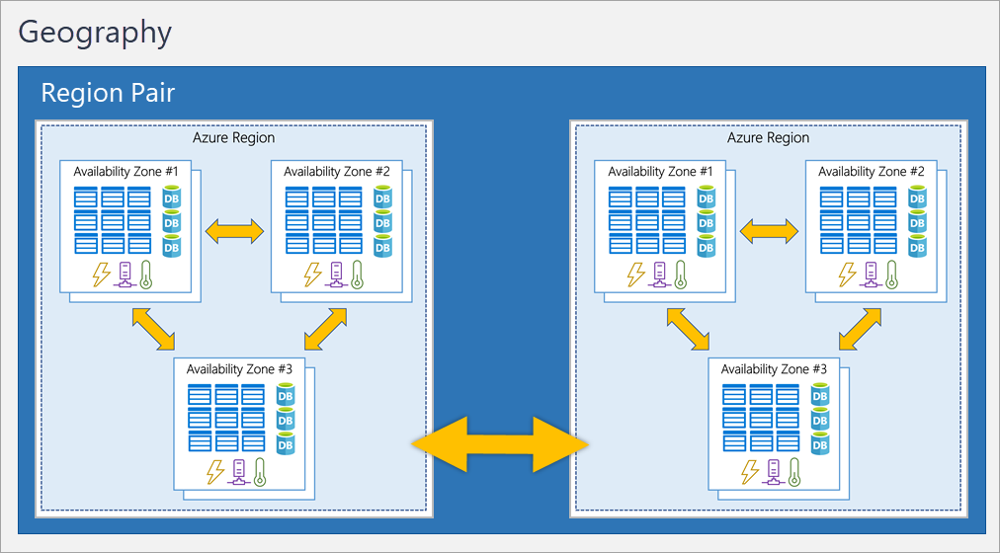

##### Sovereign Regions

***Sovereign regions*** are instances of Azure that are ***isolated*** from the main instance of Azure. You may need to use a sovereign region for ***compliance or legal*** purposes.

#### Describe Azure Management Infrastructure

The management infrastructure includes Azure resources and resource groups, subscriptions, and accounts.

##### Azure Resources And Resource Groups

A ***resource*** is the basic building block of Azure. ***Resource groups*** are simply groupings of resources. When you create a ***resource***, you’re required to place it into a ***resource group***.

***Resource groups*** provide a convenient way to group resources together. When you ***apply*** an action to a ***resource group***, that action ***will apply*** to all the ***resources*** within the ***resource group***.

If you ***delete*** a ***resource group***, all the ***resources*** will be ***deleted***. If you ***grant or deny*** access to a ***resource group***, you’ve ***granted or denied*** access to all the ***resources*** within the ***resource group***.

##### Azure Subscriptions

Similar to how resource groups are a way to logically organize resources, ***subscriptions*** allow you to logically ***organize*** your ***resource groups*** and facilitate ***billing***.

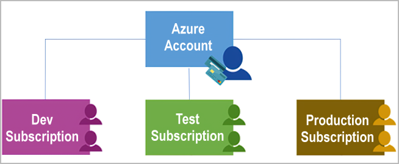

In a ***multi-subscription*** account, you can use the subscriptions to configure different ***billing models*** and apply different ***access-management*** policies.

There are two types of subscription boundaries that you can use:

1. ***Billing boundary***: Azure generates separate billing reports and invoices for each subscription so that you can organize and manage costs.
2. ***Access control boundary***: Azure applies ***access-management policies*** at the ***subscription*** level, and you can create separate subscriptions to reflect different organizational structures.
3. ***Billing***: You can create additional subscriptions for ***billing*** purposes.

##### Create Additional Azure Subscriptions

1. ***Environments***: You can choose to create ***subscriptions*** to set up ***separate environments*** for development and testing, security, or to isolate data for compliance reasons.
2. ***Organizational structures***: You can create subscriptions to reflect different ***organizational structures***.

##### Azure Management Groups

You organize ***subscriptions*** into containers called ***management groups*** and ***apply*** governance conditions to the management groups.

***Management groups*** give you enterprise-grade management at a ***large scale***, no matter what type of subscriptions you might have. Management groups can be nested.

##### Management Group, Subscriptions, And Resource Group Hierarchy

You can build a ***flexible*** structure of ***management groups*** and subscriptions to organize your resources into a hierarchy for unified policy and access management.

Some examples of how you could use management groups might be:

1. ***Create a hierarchy that applies a policy***: This policy will inherit onto all the ***subscriptions*** that are descendants of that ***management group*** and will ***apply*** to all VMs under those ***subscriptions***.
2. ***Provide user access to multiple subscriptions***: Assigning ***Azure RBAC*** at the management group level means that ***all*** sub-management groups, subscriptions, resource groups, and resources underneath that management group ***would also inherit*** those permissions.

Important facts about management groups:

1. ***10,000*** management groups can be supported in a ***single*** directory.
2. A ***management group tree*** can support up to ***six*** levels of ***depth***.
3. Each ***management group*** and ***subscription*** can support only ***one parent***.

### Module 2: Describe Azure Compute And Networking Services

This module focuses on some of the ***computer*** services and ***networking*** services available within Azure.

#### Describe Azure Virtual Machines

An ***Azure VM*** gives you the ***flexibility of virtualization*** without having to buy and maintain the physical hardware that runs the ***VM***. However, as an ***IaaS offering***, you still need to configure, update, and maintain the software that runs on the ***VM***.

***VMs*** are an ideal choice when you need:

1. ***Total control*** over the operating system (OS).
2. The ability to run ***custom software***.
3. To use ***custom hosting*** configurations.

An image is a template used to create a ***VM*** and may already include an OS and other software, like development tools or web hosting environments.

##### Scale VMs In Azure

Azure can also manage the grouping of ***VMs*** for you with features such as ***scale sets and availability sets***.

##### Virtual Machine Scale Sets

Virtual machine ***scale sets*** let you create and manage a group of ***identical, load-balanced VMs***. Scale sets allow you to centrally ***manage, configure, and update*** a large number of VMs in minutes.

***Virtual machine scale sets*** also automatically deploy a ***load balancer*** to make sure that your resources are being used efficiently.

##### Virtual Machine Availability Sets

***Availability sets*** are designed to ensure that ***VMs stagger*** updates and have varied power and network connectivity, ***preventing*** you from losing all your ***VMs*** with a single network or power failure.

1. ***Update domain***: Groups ***VMs*** that can be ***rebooted*** at the same time.
2. ***Fault domain***: Groups your ***VMs*** by ***common*** power source and network switch.

Best of all, there’s ***no additional cost*** for configuring an ***availability set***. You only pay for the VM instances you create.

##### Examples Of When To Use VMs

Some common examples or use cases for virtual machines include:

1. ***Testing*** and ***development***.
2. Running ***applications*** in the ***cloud***.
3. Extending your ***datacenter*** to the ***cloud***.
4. ***Disaster recovery***.

##### Move To The Cloud With VMs

VMs are also an excellent choice when you ***move*** from a ***physical*** server to the ***cloud*** (also known as ***lift and shift***). You can create an ***image*** of the physical server and ***host it*** within a VM with little or ***no changes***.

##### VM Resources

1. ***Size***: Purpose, number of processor cores, and amount of RAM.
2. ***Storage disks***: Hard disk drives, solid state drives, etc.
3. ***Networking***: Virtual network, public IP address, and port configuration.

#### Describe Azure Containers

***Containers*** are a ***virtualization environment***. Unlike ***virtual machines***, you don't manage the ***operating system*** for a container.

##### Azure Container Instances

***Azure Container Instances*** allow you to upload your ***containers*** and then the service will ***run*** the containers for you. ***Azure Container Instances*** are a ***platform as a service (PaaS)*** offering.

##### Use Containers In Your Solutions

***Containers*** are often used to create solutions by using a ***microservice architecture***. This architecture is where you ***break solutions*** into ***smaller, independent*** pieces. This split allows you to separate ***portions of your app*** into ***logical*** sections that can be ***maintained, scaled, or updated independently***.

#### Describe Azure Functions

***Azure Functions*** is an ***event-driven, serverless*** compute option that doesn’t require maintaining virtual machines or containers. With ***Azure Functions***, an ***event wakes*** the function, alleviating the need to keep resources provisioned when there are no events.

##### Benefit Of Azure Functions

Using ***Azure Functions*** is ideal when you are ***not concerned*** about the underlying platform or infrastructure. Functions ***scale automatically*** based on demand.

***Functions*** are commonly used when you need to ***perform work*** in response to an ***event*** (often via a REST request), ***timer***, or ***message*** from another Azure service. ***Azure Functions*** runs your code when it's ***triggered*** and ***automatically deallocates*** resources when the function is finished.

Functions can be either ***stateless*** or ***stateful***:

1. ***Stateless (default)***: They ***behave*** as if they're ***restarted*** every time they respond to an event.
2. ***Stateful (called Durable Functions)***: A context is ***passed through*** the function to track ***prior activity***.

***Functions*** are a ***key*** component of ***serverless computing***. This ***flexibility*** allows you to manage scaling, run on virtual networks, and even completely isolate the functions.

#### Describe Application Hosting Options

If you need to host your application on Azure, you might initially turn to a virtual machine (VM) or containers.

##### Azure App Service

***App Service*** enables you to build and host ***web apps, background jobs, mobile back-ends, and RESTful APIs*** in the programming language of your choice without managing infrastructure.

***Azure App Service*** lets you focus on ***building*** and ***maintaining*** your app, and Azure focuses on keeping the environment up and running.

##### Types Of Apps Services

With App Service, you can host most common app service styles like:

1. ***Web apps***: Used for hosting websites and web applications.
2. ***API apps***: Used for hosting RESTful APIs.
3. ***WebJobs***: Used for running a program or script in the ***same context*** as a web app, API app, or mobile app.
4. ***Mobile apps***: Used for hosting mobile app back-ends.

***App Service*** handles most of the infrastructure decisions you deal with in hosting web-accessible apps:

1. ***Deployment and management*** are integrated into the platform.
2. ***Endpoints*** can be secured.
3. ***Sites*** can be ***scaled*** quickly to handle high traffic loads.
4. The ***built-in load balancing and traffic manager*** provide high availability.

All of these app styles are hosted in the same infrastructure and share these benefits. This flexibility makes App Service the ideal choice to host web-oriented applications.

#### Describe Azure Virtual Networking

You can think of an ***Azure network*** as an extension of your on-premises network with resources that link other ***Azure resources***.

***Azure virtual networks*** provide the following ***key*** networking capabilities:

1. ***Isolation*** and ***segmentation***: The ***IP*** range only exists within the virtual network and isn't internet routable.
2. ***Internet communications***: You can ***enable*** incoming connections from the internet.
3. ***Communicate between Azure resources***: Virtual networks can connect not only ***VMs*** but other ***Azure resources***.
4. ***Communicate with on-premises resources***:
    - ***Point-to-site*** virtual private network connections are from a computer outside your organization back into your corporate network.
    - ***Site-to-site*** virtual private networks link your on-premises VPN device or gateway to the Azure VPN gateway in a virtual network.
    - ***Azure ExpressRoute*** provides a dedicated private connectivity to Azure that doesn't travel over the internet.
5. ***Route network traffic***:
    - ***Route tables*** allow you to define rules about ***how*** traffic should be directed.
    - ***Border Gateway Protocol (BGP)***: Routing protocol that allows you to exchange routes between your on-premises network and Azure.
6. ***Filter network traffic***:
    - ***Network security groups*** are Azure resources that can contain multiple inbound and outbound security rules.
    - A ***network virtual appliance*** carries out a particular network function, such as running a ***firewall*** or performing ***wide area network (WAN)*** optimization.
7. ***Connect virtual networks***:
    - Network traffic between ***peered networks*** is private, and travels on the Microsoft backbone network, ***never*** entering the public internet.
    - ***User-defined routes (UDR)*** allow you to control the routing tables between subnets within a virtual network or between virtual networks.

***Azure virtual networking*** supports both ***public and private*** endpoints to enable communication between external or internal resources with other internal resources:

1. ***Public endpoints***: Have a public IP address and can be accessed from ***anywhere*** in the world.
2. ***Private endpoints***: Exist within a ***virtual network*** and have a ***private IP*** address from within the address space of that virtual network.

#### Describe Azure Virtual Private Networks

***VPNs*** are typically deployed to connect two or more ***trusted*** private networks to one another ***over an untrusted network*** (typically the ***public internet***). ***VPNs*** can enable networks to safely and securely share ***sensitive information***.

##### VPN Gateway

A ***VPN gateway*** is a type of virtual network gateway.

1. Connect ***on-premises datacenters to virtual networks*** through a ***site-to-site*** connection.
2. Connect ***individual devices to virtual networks*** through a ***point-to-site*** connection.
3. Connect ***virtual networks to other virtual networks*** through a ***network-to-network*** connection.

> All data transfer is ***encrypted*** inside a private tunnel as it crosses the internet.

When you deploy a VPN gateway, you specify the VPN type: either ***policy-based or route-based***.

1. ***Policy-based VPN gateways***: Specify statically the ***IP address*** of packets that should be ***encrypted*** through each tunnel.
2. ***Route-based gateways***: ***IPSec tunnels*** are modeled as a network interface or virtual tunnel interface.

Use a ***route-based VPN gateway*** if you need any of the following types of connectivity:

1. Connections ***between*** virtual networks
2. ***Point-to-site*** connections
3. ***Multisite*** connections
4. ***Coexistence*** with an ***Azure ExpressRoute*** gateway

##### High-availability scenarios

There are a few ways to maximize the ***resiliency*** of your VPN gateway.

1. ***Active/standby***: When planned maintenance or unplanned disruption ***affects*** the active instance, the ***standby*** instance ***automatically*** assumes ***responsibility*** for connections without any user intervention.
2. ***Active/active***: In this configuration, you assign a ***unique public IP address*** to each instance. You then create ***separate tunnels*** from the on-premises device to each IP address.
3. ***ExpressRoute Failover***: In high-availability scenarios, where there's risk associated with an outage of an ***ExpressRoute circuit***, you can also provision a ***VPN gateway*** that uses the ***internet*** as an ***alternative*** method of connectivity.
4. ***Zone Redundant Gateways***: Deploying gateways in ***Azure availability zones*** physically and logically separates gateways within a region while protecting your on-premises network connectivity to Azure from zone-level failures.

#### Describe Azure ExpressRoute

***Azure ExpressRoute*** lets you extend your on-premises networks into the Microsoft cloud over a private connection, with the help of a connectivity provider.

***Connectivity*** can be from an ***any-to-any (IP VPN) network***, a ***point-to-point Ethernet network***, or a ***virtual cross-connection*** through a connectivity provider at a colocation facility.

***ExpressRoute*** connections ***don't*** go over the ***public Internet***. This allows ***ExpressRoute*** connections to offer more ***reliability, faster speeds, consistent latencies, and higher security*** than typical connections over the Internet.

##### Features And Benefits Of ExpressRoute

There are several benefits to using ***ExpressRoute*** as the connection service between Azure and on-premises networks.

1. Connectivity to Microsoft ***cloud services*** across ***all regions*** in the geopolitical region.
    - Microsoft ***Office 365***
    - Microsoft ***Dynamics 365***
    - ***Azure compute services***, such as Azure Virtual Machines
    - ***Azure cloud services***, such as Azure Cosmos DB and Azure Storage
2. ***Global connectivity*** to Microsoft services across all regions with the ***ExpressRoute Global Reach***.
    - You can enable ***ExpressRoute Global Reach*** to exchange data across your on-premises sites by connecting your ***ExpressRoute circuits***.
3. ***Dynamic routing*** between your network and Microsoft via ***Border Gateway Protocol (BGP)***.
    - This protocol enables ***dynamic routing*** between your ***on-premises network*** and ***services*** running in the Microsoft cloud.
4. Built-in ***redundancy*** in every peering location for ***higher reliability***.
    - Each connectivity provider uses redundant devices to ensure that connections established with Microsoft are highly available.

##### ExpressRoute Connectivity Models

***ExpressRoute*** supports four models that you can use to connect your on-premises network to the Microsoft cloud:

1. ***CloudExchange colocation***: Co-location refers to your datacenter, office, or other facility being physically co-located at a cloud exchange, such as an ISP.
2. ***Point-to-point Ethernet connection***: Refers to using a ***point-to-point*** connection to connect your facility to the Microsoft cloud.
3. ***Any-to-any connection***: You can integrate your ***wide area network (WAN)*** with Azure by providing connections to your offices and datacenters.
4. ***Directly from ExpressRoute sites***: ***ExpressRoute Direct*** provides dual 100 Gbps or 10-Gbps connectivity, which supports ***Active/Active*** connectivity at scale.

#### Describe Azure DNS

***Azure DNS*** is a hosting service for ***DNS domains*** that provides ***name resolution*** by using Microsoft Azure infrastructure.

##### Benefit Of Azure DNS

***Azure DNS*** leverages the scope and scale of Microsoft Azure to provide numerous benefits, including:

1. ***Reliability and performance***:
    - Azure DNS uses anycast networking, so each DNS query is answered by the closest available DNS server to provide fast performance and high availability for your domain.
2. ***Security***:
    - ***Azure role-based access control (Azure RBAC)*** to control who has access to specific actions for your organization.
    - ***Activity logs*** to monitor how a user in your organization modified a resource or to find an error when troubleshooting.
    - ***Resource locking*** to lock a subscription, resource group, or resource. Locking prevents other users in your organization from accidentally deleting or modifying critical resources.
3. ***Ease of Use***
    - Because Azure DNS is running on Azure, it means you can manage your domains and records with the Azure portal, Azure PowerShell cmdlets, and the cross-platform Azure CLI.
4. ***Customizable virtual networks***
    - ***Azure DNS*** also supports private DNS domains. This feature allows you to use your ***own custom domain names*** in your private virtual networks, rather than being stuck with the Azure-provided names.
5. ***Alias records***
    - If the ***IP address*** of the underlying resource changes, the ***alias record set*** seamlessly ***updates itself*** during DNS resolution. The ***alias record set*** points to the service instance, and the service instance is associated with an ***IP address***.

### Module 3: Describe Azure Storage Services

This module introduces you to ***storage*** in Azure, including things such as different types of storage and how a ***distributed*** infrastructure can make your data more ***resilient***.

#### Describe Data Storage Accounts

A ***storage account*** provides a unique namespace for your Azure Storage data that's accessible from ***anywhere*** in the world over HTTP or HTTPS.

In order to do this, every ***storage account*** in Azure must have a ***unique-in-Azure*** account name. The ***combination*** of the ***account name*** and the Azure Storage ***service endpoint*** forms the endpoints for your storage account.

#### Describe Azure Storage Redundancy

***Redundancy*** ensures that your storage account meets its ***availability*** and ***durability*** targets even in the face of failures.

The factors that help determine which redundancy option you should choose include:

1. How your data is ***replicated*** in the ***primary region***.
2. Whether your data is ***replicated*** to a ***second region*** that is ***geographically distant*** to the ***primary region***, to protect against regional disasters.
3. Whether your application requires ***read access*** to the replicated data in the ***secondary region*** if the primary region becomes ***unavailable***.

##### Redundancy In The Primary Region

***Data*** in an Azure Storage account is ***always replicated three times*** in the ***primary region***.

- ***Locally Redundant Storage (LRS)***: Replicates your data ***three times*** within a single data center in the ***primary region***. ***LRS*** is the ***lowest-cost redundancy*** option and offers the least durability compared to other options. ***(11 nines)***

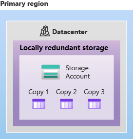

- ***Zone Redundant Storage (ZRS)***: Replicates your Azure Storage data ***synchronously*** across ***three Azure availability zones*** in the ***primary region***. With ZRS, your data is still accessible for both ***read and write*** operations even if a zone becomes unavailable. ***(12 nines)***

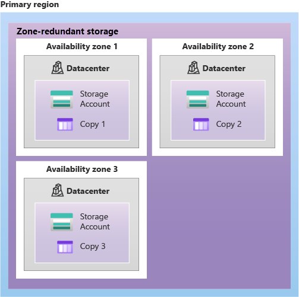

##### Redundancy In A Secondary Region

When you create a ***storage account***, you select the ***primary region*** for the account. The ***paired secondary region*** is based on Azure Region Pairs, and ***can't be changed***.

- ***Recovery Point Objective (RPO)***: The RPO indicates the ***point in time*** to which data can be ***recovered***.

- ***Geo-redundant Storage***: It then ***copies*** your data ***three times asynchronously*** to a single physical location in the ***secondary region*** (the region pair) using ***LRS***. ***(16 nines)***

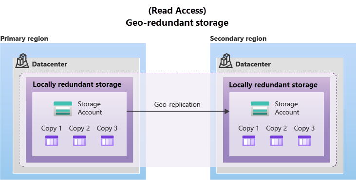

- ***Geo-zone-redundant Storage***: Data in a GZRS storage account is ***copied*** across ***three Azure availability zones*** in the ***primary region*** (similar to ZRS) and is also ***replicated*** to a ***secondary*** geographic region, using ***LRS***, for protection from regional disasters. ***(16 nines)***

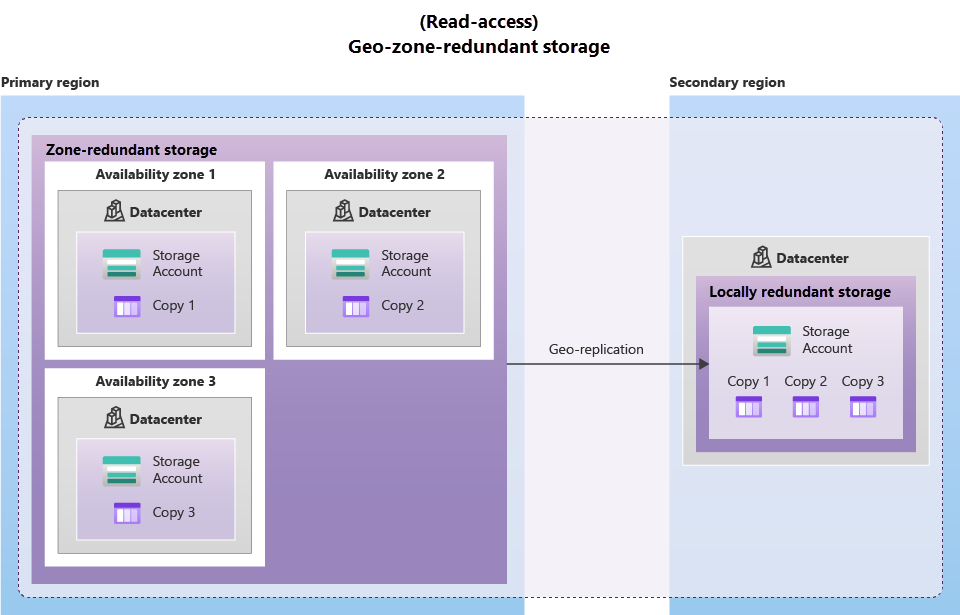

If you enable ***read access*** to the ***secondary region***, your data is ***always*** available, even when the ***primary region*** is ***running optimally***.

#### Describe Azure Storage Services

The Azure Storage platform includes the following data services:

1. ***Azure Blobs***
    - A ***massively scalable*** object store for ***text*** and ***binary data***.
    - ***Unstructured***, meaning that there are no restrictions on the kinds of data it can hold.
    - Blobs ***aren't*** limited to ***common file formats***.
    - Objects in Blob storage can be ***accessed*** from anywhere in the world via ***HTTP or HTTPS***.
    - Blob storage is ideal for:
        1. Serving ***images*** or ***documents*** directly to a ***browser***.
        2. Storing ***files*** for ***distributed access***.
        3. ***Streaming*** video and audio.
        4. Storing data for ***backup and restore***, disaster recovery, and archiving.
        5. Storing data for ***analysis*** by an on-premises or Azure-hosted service.
2. ***Azure Files***
    - Azure Files offers ***fully managed*** file shares in the cloud.
    - Azure Files key ***benefits***:
        1. ***Shared access***: Azure file shares support the industry standard ***Server Message Block (SMB)*** and ***Network File System (NFS)*** protocols.
        2. ***Fully managed***: Azure file ***shares*** can be created without the need to manage ***hardware or an OS***.
        3. ***Scripting and tooling***: ***PowerShell*** cmdlets and Azure CLI can be used to ***create, mount, and manage*** Azure file shares as part of the administration of Azure applications.
        4. ***Resiliency***: Azure Files has been ***built*** from the ground up to ***always be available***.
        5. ***Familiar programmability***: ***Applications*** running in Azure can ***access data*** in the share via file system ***I/O APIs***.
3. ***Azure Queues***
    - A ***messaging*** store for reliable messaging between application components.
    - Each individual message can be up to ***64 KB*** in size.
    - ***Queues*** are commonly used to create a ***backlog*** of work to process ***asynchronously***.
    - ***Queue*** storage can be combined with ***compute functions*** like Azure Functions to take an ***action*** when a ***message*** is received.
4. ***Azure Disks***
    - ***Block-level*** storage volumes for ***Azure VMs***.
    - They’re the same as a ***physical disk***, but they’re ***virtualized***

Data stored in the cloud can be handled differently based on ***how it's generated, processed, and accessed*** over its lifetime.

1. ***Hot access tier***: Optimized for storing data that is ***accessed frequently*** (for example, images for your website).
    - Can be set at the ***account level***.
    - Can be set at the ***blob level***, during or after upload.
2. ***Cool access tier***: Optimized for data that is ***infrequently accessed*** and stored for ***at least 30 days*** (for example, invoices for your customers).
    - Can be set at the ***account level***.
    - Can be set at the ***blob level***., during or after upload.
    - Requires high durability, retrieval latency, and throughput ***characteristics similar to hot data***.
    - Slightly ***lower*** availability service-level agreement ***(SLA)*** and ***higher access costs***.
3. ***Archive access tier***: Appropriate for data that is ***rarely accessed*** and stored for ***at least 180 days***, with flexible latency requirements (for example, long-term backups).
    - ***Isn't*** available at the ***account level***.
    - Can be set at the ***blob level***, during or after upload.
    - Offers the ***lowest storage costs***, but also the ***highest costs to access*** data.

##### Benefits Of Azure Storage

Azure Storage services offer the following benefits for application developers and IT professionals:

1. ***Durable and highly available***: Redundancy ensures that your data is safe if transient hardware failures occur.
2. ***Secure***: All data written to an Azure storage account is encrypted by the service.
3. ***Managed***: Azure handles hardware maintenance, updates, and critical issues for you.
4. ***Accessible***: Data in Azure Storage is accessible from anywhere in the world over HTTP or HTTPS.

#### Identify Azure Data Migration Options

Azure supports both ***real-time migration*** of infrastructure, applications, and data using ***Azure Migrate*** as well as ***asynchronous migration*** of data using ***Azure Data Box***.

##### Azure Migrate

***Azure Migrate*** is a service that helps you migrate from an on-premises environment to the cloud. It provides the following:

1. ***Unified migration platform***: A single portal to start, run, and track your migration to Azure.
2. ***Range of tools***: A range of tools for assessment and migration.
3. ***Assessment and migration***: In the ***Azure Migrate hub***, you can assess and migrate your on-premises infrastructure to Azure.

***Azure Migrate hub*** also includes the following tools to help with migration:

1. ***Azure Migrate, Discovery and assessment***: Discover and assess on-premises servers running on VMware, Hyper-V, and physical servers in ***preparation for migration*** to Azure.
2. ***Azure Migrate, Server Migration***: Migrate VMware VMs, Hyper-V VMs, physical servers, other virtualized servers, and public cloud VMs ***to Azure***.
3. ***Data Migration Assistant***: Stand-alone tool to assess SQL Servers. It helps pinpoint potential problems blocking migration.
4. ***Azure Database Migration Service***: Migrate on-premises ***databases*** to Azure VMs running SQL Server, Azure SQL Database, or SQL Managed Instances.
5. ***Web app migration assistant***: Standalone tool to assess on-premises ***websites*** for migration to ***Azure App Service***.
6. ***Azure Data Box***: Use Azure Data Box products to move ***large amounts of offline data*** to Azure.

##### Azure Data Box

The ***secure data transfer*** is accelerated by shipping you a proprietary ***Data Box storage device*** that has a maximum usable storage capacity of ***80 terabytes***. Data Box is ***ideally suited*** to transfer data sizes ***larger than 40 TBs*** in scenarios with no to limited network connectivity.

Here are the various scenarios where ***Data Box*** can be used to ***import*** data to Azure.

1. ***Onetime migration*** - when a *large amount of on-premises data is moved to Azure.
2. Moving a media library from ***offline tapes*** into Azure to create an ***online media library***.
3. Migrating your ***VM farm, SQL server, and applications*** to Azure.
4. Moving ***historical data*** to Azure for in-depth ***analysis and reporting*** using ***HDInsight***.
5. ***Initial bulk transfer*** - when an initial bulk transfer is done using Data Box ***(seed)*** followed by ***incremental transfers*** over the network.
6. ***Periodic uploads*** - when large amount of data is generated periodically and needs to be moved to Azure.

Here are the various scenarios where Data Box can be used to export data from Azure.

1. ***Disaster recovery*** - in a typical disaster recovery scenario, a large amount of Azure data is exported to a Data Box.
2. ***Security requirements*** - when you need to be able to export data out of Azure due to ***government*** or ***security requirements***.
3. ***Migrate back to on-premises or to another cloud service provider*** - when you want to move all the data back to on-premises, or to another cloud service provider, export data via Data Box to migrate the workloads.

#### Identify Azure File Movement Options

In addition to ***large scale migration*** using services like Azure Migrate and Azure Data Box, Azure also has ***tools*** designed to help you move or interact with ***individual files or small file groups***.

##### AzCopy

With ***AzCopy***, you can ***upload*** files, ***download*** files, ***copy*** files ***between storage accounts***, and even ***synchronize (one direction)*** files. ***AzCopy*** can even be configured to ***work with other cloud providers*** to help move files back and forth between clouds.

##### Azure Storage Explorer

***Azure Storage Explorer*** is a standalone app that provides a ***graphical interface*** to manage ***files and blobs*** in your Azure Storage Account.

##### Azure File Sync

***Azure File Sync*** is a tool that lets you ***centralize*** your file shares in Azure Files and keep the ***flexibility, performance, and compatibility*** of a ***Windows file server***.

With ***Azure File Sync***, you can:

1. Use ***any protocol*** that's available on ***Windows Server*** to access your data locally, including ***SMB, NFS, and FTPS***.
2. Have as many ***caches as you need*** across the world.
3. ***Replace a failed local server*** by installing Azure File Sync on a new server in the same datacenter.
4. Configure ***cloud tiering*** so the most ***frequently*** accessed files are replicated ***locally***, while ***infrequently*** accessed files are kept in the ***cloud until requested***.

### Module 4: Describe Azure Identity, Access And Security Services

This module covers some of the ***authorization and authentication*** methods available with Azure.

#### Describe Azure Directory Services

With ***Azure AD***, you control the identity accounts, but Microsoft ensures that the service is available globally.

##### Who Uses Azure AD?

***Azure AD*** is for:

1. ***IT administrators***: Administrators can use Azure AD to control access to applications and resources based on their business requirements.
2. ***App developers***: Adding SSO functionality to an app or enabling an app to work with a user's existing credentials.
3. ***Users***: Users can manage their identities and take maintenance actions like self-service password reset.
4. ***Online service subscribers***: Microsoft 365, Microsoft Office 365, Azure, and Microsoft Dynamics CRM Online subscribers are already using Azure AD to authenticate into their account.

##### What Does Azure AD Do?

***Azure AD*** provides services such as:

1. ***Authentication***: This includes verifying identity to access applications and resources.
2. ***Single sign-on (SSO)***: Enables you to remember only one username and one password to access multiple applications.
3. ***Application management***: You can manage your cloud and on-premises apps by using Azure AD.
4. ***Device management***: Allows for device-based Conditional Access policies to restrict access attempts to only those coming from known devices, regardless of the requesting user account.

##### Can I Connect My On-premises AD With Azure AD?

***Azure AD Connect*** synchronizes user identities between on-premises Active Directory and ***Azure AD***.

##### What is Azure Active Directory Domain Services?

***Azure Active Directory Domain Services (Azure AD DS)*** is a service that provides ***managed domain services*** such as domain join, group policy, lightweight directory access protocol (LDAP), and Kerberos/NTLM authentication.

In a ***hybrid*** environment with an on-premises AD DS environment, Azure AD Connect synchronizes identity information with Azure AD, which is then synchronized to the managed domain.

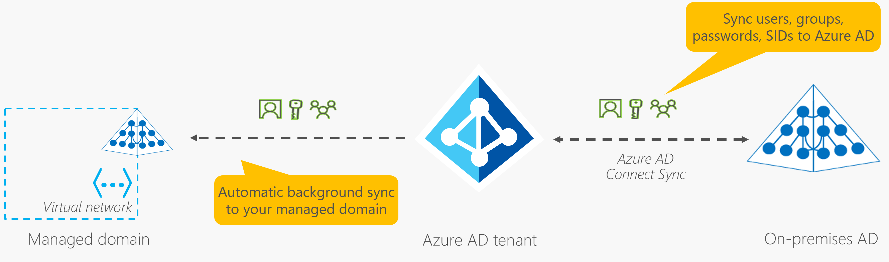

#### Describe Azure Authentication Methods

***Authentication*** is the process of establishing the identity of a person, service, or device. It requires the person, service, or device to provide some type of ***credential*** to prove who they are.

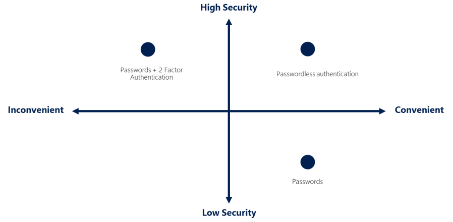

##### What Is Single Sing-On (SSO)?

1. ***Single sign-on (SSO)***:
    - You need to remember ***only one*** ID and one password.
    - Access across applications is granted to a ***single identity*** that's tied to the user.
    - As users change roles or leave an organization, access is tied to a ***single identity***.
    - Makes it ***easier*** for users to manage their identities and for IT to manage users.

##### What’s Multifactor Authentication?

***Multifactor authentication*** is the process of prompting a user for an ***extra form (or factor)*** of identification during the sign-in process. ***MFA*** helps protect against a ***password compromise*** in situations where the password was compromised but the second factor wasn't.

1. ***Something the user knows*** – this might be a challenge question.
2. ***Something the user has*** – this might be a code that's sent to the user's mobile phone.
3. ***Something the user is*** – this is typically some sort of biometric property, such as a fingerprint or face scan.

##### What’s Passwordless Authentication?

***Passwordless authentication*** methods are more convenient because the ***password*** is ***removed*** and replaced with something you have, plus something you are, or something you know.

Microsoft global Azure and Azure Government offer the following three passwordless authentication options that integrate with Azure Active Directory (Azure AD):

1. ***Windows Hello for Business***: The ***biometric and PIN*** credentials are directly tied to the user's PC, which prevents access from anyone other than the owner.
2. ***Microsoft Authenticator app***: Users can sign-in to any platform or browser by getting a notification to their phone, matching a number displayed on the screen to the one on their phone, and then using their biometric (touch or face) or PIN to confirm.
3. ***FIDO2 security keys***: These FIDO2 security keys are typically USB devices, but could also use Bluetooth or NFC.

#### Describe External Identities

***Azure AD External Identities*** refers to all the ways you can securely interact with users outside of your organization.

The following capabilities make up ***External Identities***:

1. ***Business to business (B2B) collaboration*** - Collaborate with external users by letting them use their ***preferred identity*** to sign-in to your Microsoft applications or other enterprise applications (SaaS apps, custom-developed apps, etc.).
2. ***B2B direct connect*** - Establish a mutual, two-way trust with ***another Azure AD organization*** for seamless collaboration.
3. ***Azure AD business to customer (B2C)*** - Publish modern SaaS apps or custom-developed apps (excluding Microsoft apps) to consumers and customers, while using ***Azure AD B2C*** for identity and access management.

#### Describe Azure Conditional Access

Based on ***signals***, the decision might be to allow full access if the user is ***signing*** in from their usual location. If the user is ***signing*** in from an ***unusual location*** or a location that's marked as high risk, then access might be ***blocked*** entirely or possibly granted after the user ***provides*** a second form of ***authentication***.

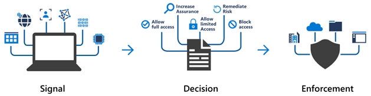

##### When Can I Use Conditional Access?

***Conditional Access*** is useful when you need to:

1. Require ***multifactor authentication (MFA)*** to access an application depending on the requester’s role, location, or network.
2. Require access to services only through ***approved client applications***.
3. Require users to access your application only from ***managed devices***. A managed device is a device that meets your standards for security and compliance.
4. ***Block*** access from ***untrusted*** sources, such as access from unknown or unexpected locations.

#### Describe Azure Role-Based Access Control (RBAC)

***The principle of least privilege*** says you should only grant access up to the level needed to complete a task. Azure enables you to control access through ***Azure role-based access control (Azure RBAC)***.  When you assign individuals or groups to one or more roles, they receive all the ***associated access permissions***.

Similarly, if you add additional ***resources*** and point ***Azure RBAC*** at them, everyone in that ***Azure RBAC group*** will now have those ***permissions*** on the new resources as well as the existing resources.

##### How is role-based access control applied to resources?

***Role-based access control*** is applied to a scope, which is a resource or set of resources that this access applies to.

Scopes include:

1. A management group (a collection of multiple subscriptions).
2. A single subscription.
3. A resource group.
4. A single resource.

***Azure RBAC*** is hierarchical, in that when you grant access at a parent scope, those permissions are ***inherited*** by all child scopes.

##### How Azure RBAC Is Enforced?

***Azure RBAC*** is enforced on ***any action*** that's initiated against an ***Azure resource*** that passes through ***Azure Resource Manager***.

***Resource Manager*** is a management service that provides a way to ***organize*** and ***secure*** your ***cloud resources***. When you're assigned a role, ***Azure RBAC*** allows you to perform ***actions*** within the scope of that role.

#### Describe Zero Trust Model

***Zero Trust*** is a security model that assumes the ***worst case scenario*** and protects resources with that expectation.

Guiding principles:

1. ***Verify explicitly*** - Always authenticate and authorize based on all available data points.
2. ***Use least privilege access*** - Limit user access with ***Just-In-Time and Just-Enough-Access (JIT/JEA)***, risk-based adaptive policies, and data protection.
3. ***Assume breach*** - Minimize blast radius and segment access. Verify end-to-end encryption. Use analytics to get visibility, drive threat detection, and improve defenses.

##### Adjusting To Zero Trust

Instead of assuming that a device is safe because it’s within the corporate network, it requires ***everyone to authenticate***.

#### Describe Defense-in-Depth

The objective of ***defense-in-depth*** is to protect information and ***prevent*** it from being ***stolen*** by those who aren't authorized to access it. A ***defense-in-depth strategy*** uses a series of mechanisms to ***slow*** the advance of an ***attack*** that aims at acquiring ***unauthorized access*** to data.

##### Layers Of Defense-in-Depth

You can visualize ***defense-in-depth*** as a set of layers, with the ***data*** to be secured at the ***center*** and all the ***other layers*** functioning to ***protect*** that central data layer.

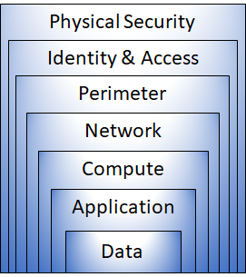

Here's a brief overview of the role of each layer:

1. ***Physical security layer***
    - Securing access to ***buildings*** and controlling access to ***computing hardware***.
    - ***Safeguards*** ensure that other layers can't be bypassed.
2. ***Identity and access layer***
    - ***Control access*** to infrastructure and change control.
    - Use ***single sign-on (SSO)*** and ***multifactor authentication***.
    - ***Audit*** events and changes.
3. ***Perimeter layer***
    - Use ***DDoS protection*** to filter large-scale attacks before they can affect the ***availability*** of a system for users.
    - Use ***perimeter firewalls*** to identify and alert on malicious ***attacks*** against your network.
4. ***Network layer***
    - ***Limit communication*** between resources.
    - ***Deny by default***.
    - ***Restrict inbound*** internet access and ***limit outbound*** access where appropriate.
    - Implement ***secure connectivity*** to on-premises networks.
5. ***Compute layer***
    - Secure access to ***virtual machines***.
    - Implement ***endpoint protection*** on devices and keep systems ***patched*** and current.
6. ***Application layer***
    - Ensure that applications are ***secure and free of vulnerabilities***.
    - Store ***sensitive application secrets*** in a secure storage medium.
    - Make ***security a design requirement*** for all application development.
7. ***Data layer***
    - Database.
    - Disk inside virtual machines.
    - Software as a service (SaaS) applications, such as Office 365.
    - Cloud storage.

#### Describe Microsoft Defender For Cloud

It ***monitors*** your cloud, on-premises, hybrid, and multicloud environments to provide ***guidance and notifications*** aimed at strengthening your security posture. When necessary, ***Defender for Cloud*** can automatically deploy a ***Log Analytics agent*** to gather security-related data.

##### Azure-native Protections

***Defender for Cloud*** helps you ***detect threats*** across:

1. ***Azure PaaS services***: ***Detect threats*** targeting Azure services including Azure App Service, Azure SQL, Azure Storage Account, and more data services.
2. ***Azure data services***: Defender for Cloud includes capabilities that help you ***automatically classify*** your data in Azure SQL.
3. ***Networks***: Defender for Cloud helps you ***limit exposure*** to brute force attacks.

##### Defend your hybrid resources

In addition to defending your Azure environment, you can add ***Defender for Cloud*** capabilities to your ***hybrid cloud environment*** to protect your non-Azure servers.

##### Defend resources running on other clouds

***Defender for Cloud*** can also protect resources in ***other clouds*** (such as AWS and GCP).

1. ***Defender for Cloud's CSPM*** features extend to your ***AWS resources***.
2. ***Microsoft Defender for Containers*** extends its container threat detection and advanced defenses to your ***Amazon EKS Linux clusters***.
3. ***Microsoft Defender for Servers*** brings threat detection and advanced defenses to your Windows and Linux ***EC2 instances***.

##### Assess, Secure, and Defend

***Defender for Cloud*** fills ***three vital needs*** as you manage the security of your resources and workloads in the cloud and on-premises:

1. ***Continuously assess*** – Know your security posture. Identify and track vulnerabilities.
    - ***Vulnerability assessment solutions*** for your virtual machines, container registries, and SQL servers.
    - Access to the ***vulnerability findings*** from Microsoft threat and vulnerability management.
2. ***Secure*** – Harden resources and services with ***Azure Security Benchmark***.
    - If new resources ***aren't secured, they're flagged*** and you get a prioritized list of recommendations for what you need to fix
    - ***Groups*** the recommendations into ***security controls*** and adds a secure score value to each control.
3. ***Defend*** – Detect and resolve threats to resources, workloads, and services.
    - ***Security Alerts***
        1. Describe details of the ***affected resources***.
        2. Suggest ***remediation steps***.
        3. Provide, in some cases, an option to trigger a ***logic app*** in response.
    - ***Advanced Threat Protection***
        1. Securing the management ports of your VMs with ***just-in-time*** access.
        2. Adaptive application controls to create ***allowlists***.

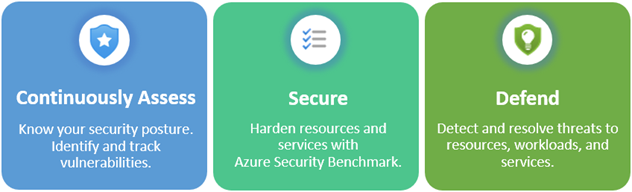

## Learning Path 3: Describe Azure Management And Governance

This learning path explores the ***management and governance*** resources available to help you manage your cloud and on-premises resources.

### Module 1: Describe Cost Management In Azure

That OpEx cost can be impacted by many factors.

#### Describe Factors That Can Affect Costs In Azure

1. ***Resource type***: The type of resources, the settings for the resource, and the Azure region will all have an impact on how much a resource costs.
2. ***Consumption***:  If you use more compute this cycle, you pay more. If you use less in the current cycle, you pay less.
3. ***Maintenance***: The flexibility of the cloud makes it possible to rapidly adjust resources based on demand.
4. ***Geography***: The cost of power, labor, taxes, and fees vary depending on the location. Network traffic is also impacted based on geography.
5. ***Subscription type***: Some Azure subscription types also include usage allowances, which affect costs.
6. ***Azure Marketplace***: Azure Marketplace lets you purchase Azure-based solutions and services from third-party vendors.

#### Compare The Pricing And Total Cost Of Ownership Calculators

Both calculators are accessible from the internet, and both calculators allow you to build out a configuration.

1. ***Pricing Calculator***
    - Focus is on the cost of ***provisioned resources*** in Azure.
    - For information purposes only. The prices are only an ***estimate***.
2. ***Total Cost of Ownership (TCO) Calculator***
    - The TCO calculator is designed to help you ***compare*** the costs for running an on-premises infrastructure ***compared to*** an Azure Cloud infrastructure.

#### Describe The Azure Cost Management Tool

***Cost Management*** provides the ability to quickly check Azure resource costs, create alerts based on resource spend, and create budgets that can be used to automate management of resources.

You use ***cost analysis*** to explore and analyze your organizational costs. You can view aggregated costs by organization to understand where costs are accrued and to identify spending trends.

##### Cost Alerts

The three types of alerts that may show up are:

1. ***Budget alerts***: Notify you when ***spending***, based on usage or cost, reaches or exceeds the amount defined in the alert condition of the budget.
2. ***Credit alerts***: Notify you when your Azure ***credit*** monetary commitments are consumed.
3. ***Department spending quota alerts***: Notify you when department spending ***reaches*** a fixed ***threshold*** of the quota.

##### Budgets

A ***budget*** is where you set a ***spending limit*** for Azure. When the budget hits the budget alert level, it will trigger a ***budget alert*** that shows up in the cost alerts area.

#### Describe The Purpose Of Tags

***Resource tags*** are another way to ***organize*** resources. Tags provide extra information, or metadata, about your resources. This metadata is useful for:

1. ***Resource management***: Tags enable you to locate and act on resources that are associated with ***specific workloads***, environments, business units, and owners.
2. ***Cost management and optimization***: Tags enable you to group resources so that you can report on ***costs***, allocate internal cost centers, track budgets, and forecast estimated cost.
3. ***Operations management***: Tags enable you to group resources according to how critical their ***availability*** is to your business.
4. ***Security Tags***: enable you to classify data by its security level, such as ***public*** or ***confidential***.
5. ***Governance and regulatory compliance***: Tags enable you to identify resources that align with governance or regulatory compliance requirements, such as ***ISO 27001***.
6. ***Workload optimization and automation***: Tags can help you visualize all of the resources that participate in ***complex deployments***.

You can use ***Azure Policy*** to enforce tagging rules and conventions. Resources ***don't inherit*** tags from subscriptions and resource groups, meaning that you can apply tags at ***one level*** and not have those tags automatically show up at a ***different level***.

### Module 2: Describe Features And Tools In Azure For Governance And Compliance

In this module, you’ll be introduced to some of the features and tools you can use to help with governance of your Azure environment. You’ll also learn about tools you can use to help keep resources in compliance with corporate or regulatory requirements.

#### Describe The Purpose Of Azure Blueprints

***Azure Blueprints*** lets you standardize cloud subscription or environment deployments.

##### What Are Artifacts?

Each component in the ***blueprint*** definition is known as an ***artifact***. It is possible for ***artifacts*** to have ***no additional*** parameters (configurations). Artifacts can also contain ***one or more*** parameters that you can configure.

***Azure Blueprints*** deploy a new environment based on all of the requirements, settings, and configurations of the ***associated artifacts***. Artifacts can include things such as:

1. ***Role assignments***
2. ***Policy assignments***
3. ***Azure Resource Manager templates***
4. ***Resource groups***

#### Describe The Purpose Of Azure Policy

***Azure Policy*** is a service in Azure that enables you to create, assign, and manage ***policies*** that control or audit your ***resources***.

##### How Does Azure Policy Define Policies?

- Enables you to ***define*** both individual policies and groups of related policies, known as ***initiatives***.
- Can be set at ***each level***, enabling you to set policies on a specific resource, resource group, subscription, and so on.
- Comes with ***built-in*** policy and initiative definitions for Storage, Networking, Compute, Security Center, and Monitoring.
- In some cases, Azure Policy can ***automatically*** remediate noncompliant resources and configurations to ensure the integrity of the state of the resources.  
- If you have a ***specific resource*** that you don’t want Azure Policy to automatically fix, you can ***flag*** that resource as an exception.
- ***Azure Policy*** also integrates with ***Azure DevOps*** by applying any continuous integration and delivery ***pipeline policies*** that pertain to the pre-deployment and post-deployment phases of your applications.

##### What Are Azure Policy Initiatives?

An ***Azure Policy initiative*** is a way of ***grouping*** related policies together. The ***initiative*** definition contains all of the ***policy*** definitions to help track your ***compliance state*** for a larger goal.

1. ***Monitor unencrypted SQL Database in Security Center***: This policy monitors for unencrypted SQL databases and servers.
2. ***Monitor OS vulnerabilities in Security Center***: This policy monitors servers that don't satisfy the configured OS vulnerability baseline.
3. ***Monitor missing Endpoint Protection in Security Center***: This policy monitors for servers that don't have an installed endpoint protection agent.

#### Describe The Purpose Of Resource Locks

Even with ***Azure role-based access control (Azure RBAC)*** policies in place, there's still a risk that people with the ***right level*** of access could ***delete*** critical cloud resources. ***Resource locks*** prevent resources from being ***deleted or updated***, depending on the type of ***lock***.

##### Types Of Resource Locks

- ***Delete*** means authorized users can still ***read and modify*** a resource, but they can't delete the resource.
- ***ReadOnly*** means authorized users can read a resource, but they ***can't delete or update*** the resource.

##### How Do I Manage Resource Locks?

To view, add, or delete ***locks*** in the ***Azure portal***, go to the ***Settings*** section of any resource's Settings pane in the ***Azure portal***.

##### How Do I Delete Or Change A Locked Resource?

To modify a ***locked*** resource, you must first ***remove the lock***. After you remove the lock, you can apply any ***action*** you have permissions to perform

#### Describe The Purpose Of The Service Trust Portal

The ***Microsoft Service Trust Portal*** is a portal that provides access to various content, tools, and other resources about ***Microsoft security, privacy, and compliance practices***.

### Module 3: Describe Features And Tools For Managing And Deploying Azure Resources

This module covers tools that help you ***manage*** your Azure and on-premises resources.

#### Describe Tool For Interacting With Azure

Azure provides multiple tools for ***managing*** your environment, including the:

1. ***Azure portal***
    - Build, manage, and monitor ***everything***.
    - Create custom ***dashboards*** for an organized view of resources.
    - Configure ***accessibility*** options for an optimal experience.
2. ***Azure PowerShell***
    - The ***routine setup, teardown, and maintenance*** of a single resource or multiple connected resources.
    - The deployment of an ***entire infrastructure***.
3. ***Azure Command Line Interface (CLI)***
    - Uses ***Bash commands***.
    - It mainly comes down to which ***language*** you’re ***most familiar*** with.

#### Describe The Purpose Of Azure Arc

In utilizing ***Azure Resource Manager (ARM)***, ***Arc*** lets you extend your Azure compliance and monitoring to your hybrid and multi-cloud configurations.

***Azure Arc*** provides a centralized, unified way to:

1. Manage your ***entire environment*** together by projecting your existing ***non-Azure*** resources into ***ARM***.
2. Manage ***multi-cloud and hybrid*** virtual machines, Kubernetes clusters, and databases as if they are running in Azure.
3. Use ***familiar Azure services*** and management capabilities, regardless of where they live.
4. Continue using ***traditional ITOps*** while introducing DevOps practices to support new cloud and native patterns in your environment.
5. Configure ***custom locations*** as an abstraction layer on top of Azure ***Arc-enabled*** Kubernetes clusters and cluster extensions.

##### What Can Azure Arc Do Outside Of Azure?

Currently, ***Azure Arc*** allows you to manage the following resource types hosted outside of Azure:

1. ***Servers***
2. ***Kubernetes clusters***
3. ***Azure data services***
4. ***SQL Server***
5. ***Virtual machines (preview)***

#### Describe Azure Resource Manager And Azure ARM Templates

It provides a management layer that enables you to ***create, update, and delete*** resources in your Azure account. Anytime you do anything with your Azure resources, ***ARM*** is involved.

##### Azure Resource Manager Benefits

With Azure Resource Manager, you can:

1. ***Manage*** your infrastructure through ***declarative templates*** rather than scripts. A ***Resource Manager template*** is a ***JSON*** file that defines what you want to deploy to Azure.
2. ***Deploy, manage, and monitor*** all the resources for your solution as a group, rather than handling these resources individually.
3. ***Re-deploy*** your solution throughout the ***development life-cycle*** and have confidence your resources are deployed in a ***consistent state***.
4. ***Define*** the dependencies between resources, so they're deployed in the correct order.
5. ***Apply*** access control to all services because ***RBAC*** is natively integrated into the ***management platform***.
6. ***Apply*** tags to resources to ***logically organize*** all the resources in your subscription.
7. ***Clarify*** your organization's ***billing*** by viewing ***costs*** for a group of resources that share the same tag.

##### ARM Templates

By using ***ARM templates***, you can describe the resources you want to use in a declarative ***JSON*** format. With an ***ARM template***, the deployment code is verified before any code is run.

##### Benefits Of Using ARM Templates

***ARM*** templates provide many benefits when planning for deploying Azure resources. Some of those benefits include:

1. ***Declarative syntax***: ***ARM templates*** allow you to create and deploy an ***entire Azure infrastructure*** declaratively. ***Declarative syntax*** means you declare what you want to deploy but don’t need to write the actual programming commands and sequence to deploy the resources.
2. ***Repeatable results***: Repeatedly deploy your infrastructure throughout the ***development lifecycle*** and have confidence your resources are deployed in a ***consistent*** manner.
3. ***Orchestration***: You don't have to worry about the complexities of ordering operations. ***Azure Resource Manager*** orchestrates the deployment of interdependent resources, so they're created in the ***correct order***. When possible, ***Azure Resource Manager*** deploys resources in ***parallel***, so your deployments finish ***faster*** than serial deployments.
4. ***Modular files***: You can break your templates into ***smaller, reusable components*** and link them together at deployment time. You can also ***nest*** one template inside another template.
5. ***Extensibility***: With deployment scripts, you can add PowerShell or Bash scripts to your templates. A ***script*** can be included in the template or stored in an external source and referenced in the template. ***Deployment scripts*** give you the ability to complete your ***end-to-end*** environment setup in a single ***ARM template***.

### Module 4: Describe Monitoring Tools In Azure

This module covers tools that you can use to monitor your Azure environment.

#### Describe The Purpose Of Azure Advisor

***Azure Advisor*** evaluates your Azure resources and makes recommendations to help improve reliability, security, and performance, achieve operational excellence, and reduce costs.

The recommendations are divided into five categories:

1. ***Reliability*** is used to ensure and improve the continuity of your ***business-critical*** applications.
2. ***Security*** is used to detect threats and vulnerabilities that might lead to ***security breaches***.
3. ***Performance*** is used to improve the ***speed*** of your applications.
4. ***Operational Excellence*** is used to help you achieve ***process and workflow*** efficiency, resource manageability, and deployment best practices.
5. ***Cost*** is used to ***optimize and reduce*** your overall Azure spending.

#### Describe Azure Service Health

***Azure Service Health*** helps you keep track of Azure resource, both your ***specifically*** deployed resources and the ***overall*** status of Azure. Azure service health does this by combining three different Azure services:

1. ***Azure Status*** is a broad picture of the status of Azure globally.
2. ***Service Health*** focuses on the Azure services and regions you're using. This is the best place to look for service impacting communications about ***outages, planned maintenance activities***, and other health advisories because the authenticated ***Service Health*** experience knows which services and resources you currently use.
3. ***Resource Health*** provides information about the ***health*** of ***your*** individual cloud resources.

Something you initially thought was a simple anomaly that turned into a trend, can readily be ***reviewed and investigated*** thanks to the ***historical alerts***.

#### Describe Azure Monitor

***Azure Monitor*** is a platform for collecting data on your resources, analyzing that data, visualizing the information, and even acting on the results.

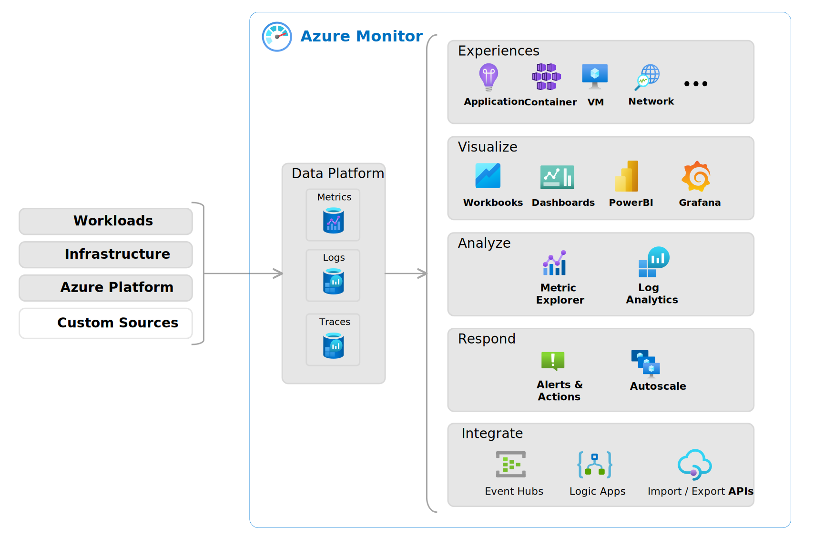

##### Azure Log Analytics

***Azure Log Analytics*** is the tool in the Azure portal where you’ll write and run ***log queries*** on the data gathered by ***Azure Monitor***. You can write an ***advanced query*** to perform ***statistical analysis and visualize*** the results in a chart to identify a particular trend.

##### Azure Monitor Alerts

***Azure Monitor Alerts*** are an automated way to stay informed when Azure Monitor detects a ***threshold*** being crossed.

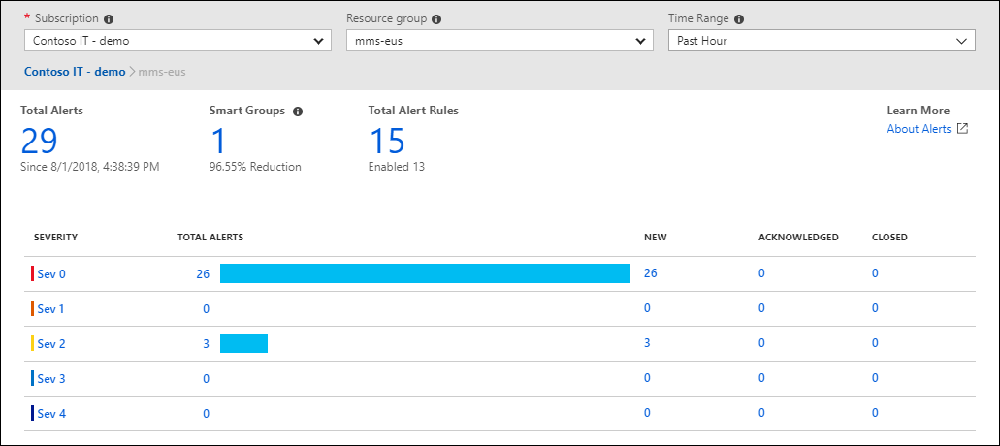

***Alert rules based on metrics*** provide near real time alerts based on numeric values. Rules based on logs allow for complex logic across data from multiple sources.

##### Application Insights

***Application Insights*** is capable of monitoring applications that are running in Azure, on-premises, or in a different cloud environment.

1. ***Request rates, response times, and failure rates***.
2. ***Dependency*** rates, response times, and failure rates, to show whether ***external services*** are slowing down performance.
3. ***Page views and load performance*** reported by users' browsers
4. ***AJAX calls from web pages***, including rates, response times, and failure rates.
5. ***User and session counts***.
6. ***Performance counters*** from Windows or Linux server machines, such as CPU, memory, and network usage.
