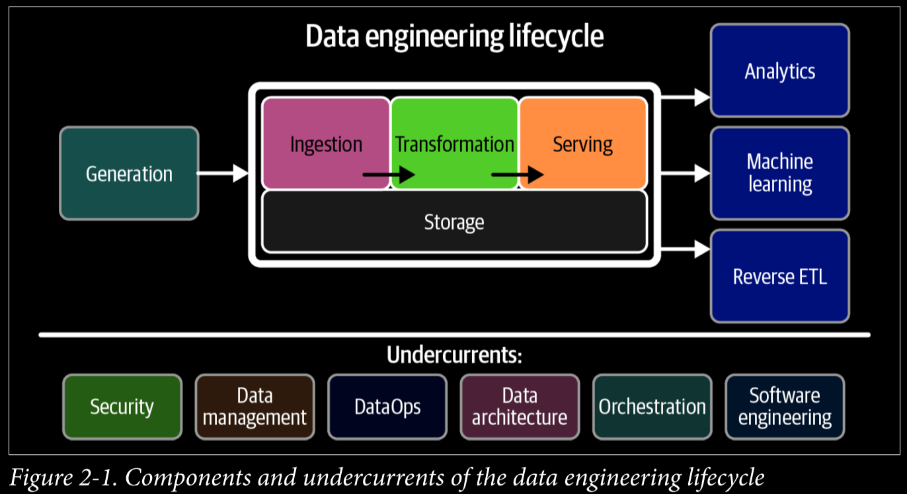
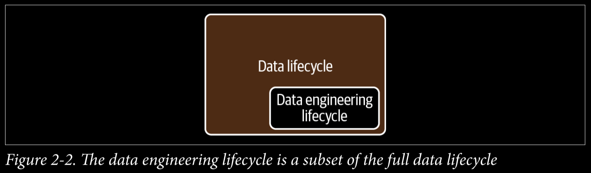
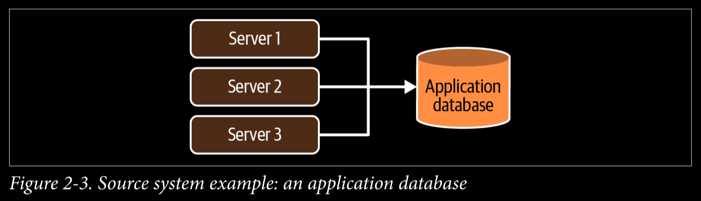
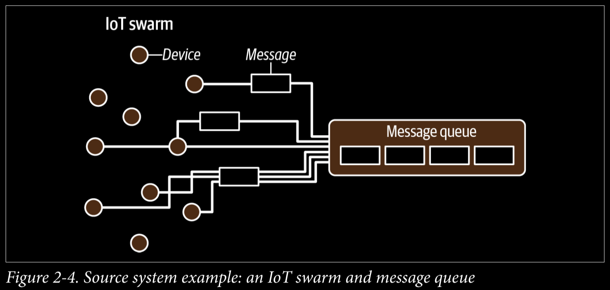
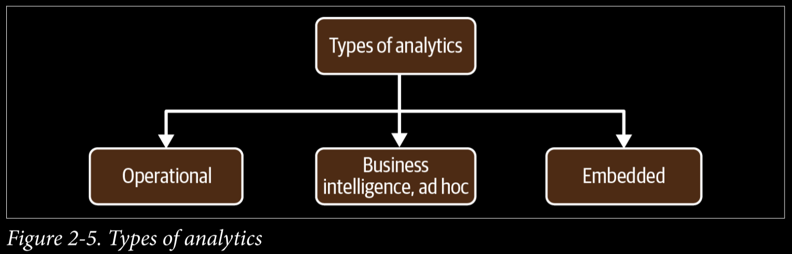
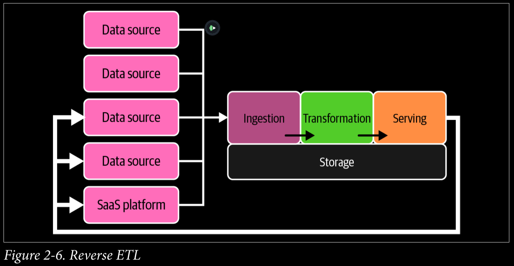
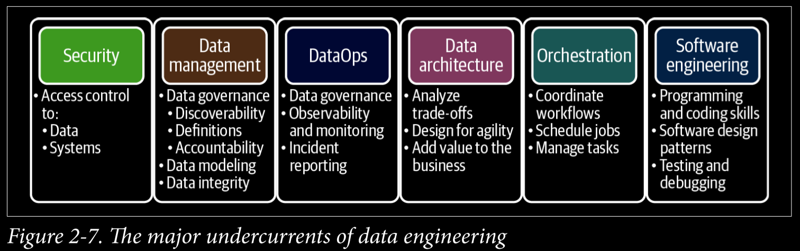

# ***Fundamentals of Data Engineering***

This book aims to fill a gap in current ***data engineering*** content and materials.

## ***Part 1:*** Foundations and Building Blocks

### ***Chapter 1:*** Data Engineering Described

Data Engineering builds the foundation for data science and analytics in production.

#### What is Data Engineering?

> **Data engineering** *is the development, implementation, and maintenance of systems and processes that take in raw data and produce high-quality, consistent information that supports downstream use cases, such as analysis and machine learning. Data engineering is the intersection of security, data management, DataOps, data architecture, orchestration, and software engineering.*

#### What is Data Engineer?

> *A* **data engineer** *manages the data engineering lifecycle, beginning with getting data from source systems and ending with serving data for use cases, such as analysis or machine learning*.

#### Data Engineering and Data Science

*Data engineering* sits *upstream* from data science (Figure 1-4), meaning *data engineers* provide the inputs used by *data scientists* (downstream from data engineering), who convert these inputs into something **useful**.

Consider the ***Data Science Hierarchy of Needs*** (Figure 1-5).

*Rogati* argues that companies need to build a *solid data foundation* (the bottom three levels of the hierarchy) before tackling areas such as **AI and ML**. When *data engineers* focus on these bottom parts of the *hierarchy*, they build a solid foundation for *data scientists* to succeed.

With *data science* driving advanced analytics and ML, *data engineering* straddles the divide between **getting data and getting value** from data (see Figure 1-6).

#### Data Engineering Skills and Activities

1. ***Understanding*** *of how to evaluate data tools and how they fit together across the data engineering lifecycle*.
2. ***Know*** *how data is produced in source systems and how analysts and data scientists will consume and create value after processing and curating data*.
3. ***Optimize*** *along the axes of cost, agility, scalability, simplicity, reuse, and interoperability* (Figure 1-7).

> *Data engineers are now* **focused** *on balancing the simplest and most cost-effective, best-of-breed services that deliver value to the business. The data engineer is also expected to* **create** *agile data architectures that evolve as new trends emerge*.

A data engineer should have a ***good functioning understanding*** of next areas to serve **stakeholders** best.

- *ML models*
- *Reports or dashboards*
- *Data analysis*
- *Key performance indicators (KPIs)*
- *Software applications*

#### Data Maturity and the Data Engineer

***Data maturity*** *is the progression toward higher data utilization, capabilities, and integration across the organization*, but data maturity does not simply depend on the age or revenue of a company. What matters is the way data is leveraged as a competitive advantage.

> *An early-stage startup can have greater data maturity than a 100-year-old company with annual revenues in the billions*

Our *data maturity model* (Figure 1-8) has three stages: **starting with data, scaling with data, and leading with data**.

A *data engineer* should focus on the following:

1. **Starting with Data**
    - ***Get buy-in*** from key *stakeholders*, including executive management.
    - Define the right ***data architecture***.
    - ***Identify and audit data*** that will support *key initiatives* and operate within the *data architecture* you designed.
    - ***Build a solid data foundation*** for future data analysts and data scientists to generate reports and models that provide competitive value.
2. **Scaling with Data**
    - Establish ***formal data practices***.
    - Create ***scalable and robust*** data architectures.
    - Adopt ***DevOps and DataOps*** practices.
    - Build systems that ***support ML***.
    - Customize ***only when*** a competitive advantage results.
3. **Leading with Data**
    - Create automation for the ***seamless introduction and usage of new data***.
    - Focus on building custom tools and systems that ***leverage data as a competitive advantage***.
    - Focus on the “enterprisey” aspects of data, such as ***data management and DataOps***.
    - Deploy tools that ***expose and disseminate data*** throughout the organization.
    - ***Collaborate efficiently*** with software engineers, ML engineers, analysts, and others.
    - ***Create a community*** and environment where people can collaborate and speak openly.

#### The Background and Skills of a Data Engineer

With respect to data, this entails knowing about various ***best practices*** around data management. On the technology end, a data engineer must be ***aware of various options*** for tools, **their interplay, and their trade-offs**. *Data engineering* is a **holistic practice**; the best data engineers view their responsibilities through ***business and technical lenses***.

> *Everyone entering the field should expect to invest a significant amount of time in* **self-study**.

#### Business Responsibilities

1. ***Know how to communicate*** with nontechnical and technical people.
    - We suggest ***paying close attention*** to organizational hierarchies, who reports to whom, how people interact, and which silos exist.
2. ***Understand how to scope and gather*** business and product requirements.
    - In addition, develop a ***sense of how data and technology*** decisions impact the business.
3. ***Understand the cultural foundations*** of Agile, DevOps, and DataOps.
    - Agile, DevOps, and DataOps are ***fundamentally cultural***, requiring buy-in across the organization.
4. ***Learn continuously***.
    - People who succeed in it are great at ***picking up new things*** while sharpening their fundamental knowledge.
    - Stay abreast of the field and ***learn how to learn***.

> *Knowing how to navigate an organization, scope and gather requirements, control costs, and continuously learn will set you apart from the data engineers who rely solely on their technical abilities to carry their career.*

#### Technical Responsibilities

You must understand ***how to build architectures*** that ***optimize performance and cost*** at a high level, using prepackaged or homegrown components. Ultimately, architectures and constituent technologies are building blocks to serve the *data engineering lifecycle*.

> *A data engineer should have production-grade software engineering chops.*

Even in a more abstract world, ***software engineering best practices*** provide a competitive advantage, and data engineers who can dive into the deep architectural details of a codebase give their companies an edge when specific technical needs arise.

***Data engineering programming languages:***

1. ***SQL***
    - The most common interface for ***databases and data lakes***.
2. ***Python***
    - The bridge language between ***data engineering and data science***.
3. ***JVM***
    - Understanding Java or ***Scala*** will be beneficial if you’re using a popular open source data framework.
4. ***bash***
    - The ***command-line interface*** for Linux operating systems.
    - If you’re using ***Windows***, feel free to substitute ***PowerShell*** for bash.

#### The Continuum of Data Engineering Roles, from A to B

1. ***Type A data engineers***
    - A stands for ***abstraction***.
    - Data engineer avoids undifferentiated heavy lifting, keeping data architecture as abstract and straightforward as possible and ***not reinventing the wheel***.
    - Type A data engineers manage the data engineering lifecycle mainly by using entirely ***off-the-shelf products, managed services, and tools***.
2. ***Type B data engineers***
    - B stands for ***build***.
    - Type B data engineers ***build data tools and systems*** that scale and leverage a company’s core competency and competitive advantage.

> *Type A and type B data engineers may work in the same company and may even be the same person!*

#### Data Engineers Inside an Organization

Depending on what they’re working on, they will interact with ***technical and nontechnical*** people and face different directions
(internal and external).

#### Internal-Facing Versus External-Facing Data Engineers

A data engineer serves several end users and faces many ***internal and external*** directions (Figure 1-9).

An ***external-facing data engineer*** *typically aligns with the users of external-facing applications, such as social media apps, Internet of Things (IoT) devices, and ecommerce platforms*. The systems built by these data engineers have a ***feedback loop*** from the application to the data pipeline, and then back to the application (Figure 1-10).

***External-facing query engines*** often handle much larger ***concurrency*** loads than *internal-facing systems*. In addition, ***security*** is a much more ***complex and sensitive*** problem for external queries, especially if the data being queried is ***multi-tenant*** *(data from many customers and housed in a single table)*.

An ***internal-facing data engineer*** typically focuses on activities crucial to the ***needs of the business and internal stakeholders*** (Figure 1-11). Examples include creating and maintaining *data pipelines and data warehouses for BI dashboards, reports, business processes, data science, and ML models*.

> *In practice, internal-facing data is usually a prerequisite to external-facing data.*

#### Data Engineers and Other Technical Roles

*Data engineers* sit at the nexus of various roles, directly or through managers, interacting with many organizational units. In this section, we’ll discuss technical roles connected to data engineering (Figure 1-12).

### ***Chapter 2:*** Data Engineering Lifecycle

In this chapter, you’ll learn about the data engineering lifecycle, which is the central theme of this book.

#### What Is the Data Engineering Lifecycle?

The ***data engineering lifecycle comprises*** stages that turn raw data ingredients into a useful end product, ready for consumption by analysts, data scientists, ML engineers, and others.

We divide the data engineering lifecycle into five stages (Figure 2-1, top):

1. ***Generation***
2. ***Storage***
3. ***Ingestion***
4. ***Transformation***
5. ***Serving data***

#### The Data Lifecycle Versus the Data Engineering Lifecycle

The *data engineering lifecycle* is a subset of the whole ***data lifecycle*** (Figure 2-2).

#### Generation: Source Systems

A ***source system*** is the origin of the data used in the *data engineering lifecycle*. The data engineer needs to have a working understanding of the way source systems work, the way they generate data, the frequency and velocity of the data, and the variety of data they generate.

Figure 2-3 illustrates a traditional source system with several *application servers* supported by a database.

Figure 2-4 illustrates an *IoT swarm*: a fleet of devices (circles) sends data messages (rectangles) to a central collection system.

##### Evaluating source systems: Key engineering considerations

The following is a starting set of evaluation questions of source systems that data engineers must consider:

- ***What are the essential characteristics of the data source?*** Is it an application? A swarm of IoT devices?
- ***How is data persisted in the source system?*** Is data persisted long term, or is it temporary and quickly deleted?
- ***At what rate is data generated?*** How many events per second? How many gigabytes per hour?
- ***What level of consistency can data engineers expect from the output data?*** If you’re running data-quality checks against the output data, how often do data inconsistencies occur—nulls where they aren’t expected, lousy formatting, etc.?
- ***How often do errors occur?***
- ***Will the data contain duplicates?***
- ***Will some data values arrive late, possibly much later than other messages produced simultaneously?***
- ***What is the schema of the ingested data?*** Will data engineers need to join across several tables or even several systems to get a complete picture of the data?
- ***If schema changes (say, a new column is added), how is this dealt with and communicated to downstream stakeholders?***
- ***How frequently should data be pulled from the source system?***
- ***For stateful systems (e.g., a database tracking customer account information), is data provided as periodic snapshots or update events from change data capture (CDC)?*** What’s the logic for how changes are performed, and how are these tracked in the source database?
- ***Who/what is the data provider that will transmit the data for downstream consumption?***
- ***Will reading from a data source impact its performance?***
- ***Does the source system have upstream data dependencies?*** What are the characteristics of these upstream systems?
- ***Are data-quality checks in place to check for late or missing data?***

The ***schema*** defines the hierarchical organization of data. Two popular options are ***schemaless*** and ***fixed schema***.

1. ***Schemaless*** doesn’t mean the absence of schema. Rather, it means that the application defines the schema as data is written, whether to a message queue, a flat file, a blob, or a document database such as MongoDB.
2. A more traditional model built on relational database storage uses a ***fixed schema*** enforced in the database, to which application writes must conform

> *Schemas change over time; in fact, schema evolution is encouraged in the Agile approach to software development.*

#### Storage

Choosing a storage solution is key to success in the rest of the *data lifecycle*, and it’s also one of the most complicated stages of the *data lifecycle* for a variety of reasons.

##### Evaluating storage systems: Key engineering considerations

- ***Is this storage solution compatible with the architecture’s required write and read speeds?***
- ***Will storage create a bottleneck for downstream processes?***
- ***Do you understand how this storage technology works?*** Are you utilizing the storage system optimally or committing unnatural acts? For instance, are you applying a high rate of random access updates in an object storage system? (This is an antipattern with significant performance overhead.)
- ***Will this storage system handle anticipated future scale?*** You should consider all capacity limits on the storage system: total available storage, read operation rate, write volume, etc.
- ***Will downstream users and processes be able to retrieve data in the required service-level agreement (SLA)?***
- ***Are you capturing metadata about schema evolution, data flows, data lineage, and so forth?*** Metadata has a significant impact on the utility of data. Metadata represents an investment in the future, dramatically enhancing discoverability and institutional knowledge to streamline future projects and architecture changes.
- ***Is this a pure storage solution (object storage), or does it support complex query patterns (i.e., a cloud data warehouse)?***
- ***Is the storage system schema-agnostic (object storage)? Flexible schema (Cassandra)? Enforced schema (a cloud data warehouse)?***
- ***How are you tracking master data, golden records data quality, and data lineage for data governance?***
- ***How are you handling regulatory compliance and data sovereignty?*** For example, can you store your data in certain geographical locations but not others?

##### Understanding data access frequency

Not all data is accessed in the same way. This brings up the notion of the ***“temperatures”*** of data.

1. ***Hot data***
    - This data should be stored for fast retrieval, where ***“fast”*** is relative to the use case.
2. Cold data
    - Seldom queried and is appropriate for storing in an ***archival system***.
    - Often retained for ***compliance*** purposes or in case of a catastrophic failure in another system.

##### Selecting a storage system

There is no one-size-fits-all universal storage recommendation. Every storage technology has its trade-offs.

#### Ingestion

In our experience, source systems and ingestion represent the most significant ***bottlenecks*** of the *data engineering lifecycle*.

##### Key engineering considerations for the ingestion phase

When preparing to architect or build a system, here are some primary questions about the ingestion stage:

- ***What are the use cases for the data I’m ingesting?*** Can I reuse this data rather than create multiple versions of the same dataset?
- ***Are the systems generating and ingesting this data reliably, and is the data available when I need it?***
- ***What is the data destination after ingestion?***
- ***How frequently will I need to access the data?***
- ***In what volume will the data typically arrive?***
- ***What format is the data in?*** Can my downstream storage and transformation systems handle this format?
- ***Is the source data in good shape for immediate downstream use?*** If so, for how long, and what may cause it to be unusable?
- ***If the data is from a streaming source, does it need to be transformed before reaching its destination?*** Would an in-flight transformation be appropriate, where the data is transformed within the stream itself?

##### Batch versus streaming

1. ***Batch ingestion***
    - Specialized and convenient way of processing this stream in ***large chunks***.
    - Batch data is ingested either on a predetermined ***time interval*** or as data reaches a preset ***size threshold***.
    - Once data is broken into batches, the latency for downstream consumers is ***inherently constrained***.
2. ***Streaming ingestion***
    - Streaming ingestion allows us to provide data to downstream systems in a continuous, ***real-time fashion***.
    - ***Real-time (or near real-time)*** means that the data is available to a downstream system a short time after it is produced
    - The ***latency*** required to qualify as real-time varies by ***domain and requirements***.

##### Key considerations for batch versus stream ingestion

The following are some questions to ask yourself when determining whether streaming ingestion is an appropriate choice over batch ingestion:

- ***If I ingest the data in real time, can downstream storage systems handle the rate of data flow?***
- ***Do I need millisecond real-time data ingestion?*** Or would a micro-batch approach work, accumulating and ingesting data, say, every minute?
- ***What are my use cases for streaming ingestion?*** What specific benefits do I realize by implementing streaming? If I get data in real time, what actions can I take on that data that would be an improvement upon batch?
- ***Will my streaming-first approach cost more in terms of time, money, maintenance, downtime, and opportunity cost than simply doing batch?***
- ***Are my streaming pipeline and system reliable and redundant if infrastructure fails?***
- ***What tools are most appropriate for the use case?*** Should I use a managed service (Amazon Kinesis, Google Cloud Pub/Sub, Google Cloud Dataflow) or stand up my own instances of Kafka, Flink, Spark, Pulsar, etc.? If I do the latter, who will manage it? What are the costs and trade-offs?
- ***If I’m deploying an ML model, what benefits do I have with online predictions and possibly continuous training?***
- ***Am I getting data from a live production instance?*** If so, what’s the impact of my ingestion process on this source system?

> *Batch is an excellent approach for many common use cases, such as model training and weekly reporting. Adopt true real-time streaming only after identifying a business use case that justifies the trade-offs against using batch.*

##### Push versus pull

1. ***Push***
    - A source system writes data out to a target, whether a database, object store, or filesystem.
2. ***Pull***
    - Data is retrieved from the source system.

#### Transformation

Typically, the transformation stage is where data begins to create value for downstream user consumption.

##### Key considerations for the transformation phase

When considering data transformations within the data engineering lifecycle, it helps to consider the following:

- ***What’s the cost and return on investment (ROI) of the transformation?*** What is the associated business value?
- ***Is the transformation as simple and self-isolated as possible?***
- ***What business rules do the transformations support?***

> *The lifecycle can be much more complicated in practice.*

***Transformations*** are ubiquitous in various parts of the lifecycle.

1. Data preparation
2. Data wrangling
3. Data cleaning

***Business logic*** is a major driver of ***data transformation***, often in ***data modeling***. *Data modeling* is critical for obtaining a clear and current picture of *business processes*.

***Data featurization*** for ML is another *data transformation* process. The main point is that once data scientists determine how to featurize data, ***featurization processes*** can be ***automated*** by data engineers in the transformation stage of a ***data pipeline***.

#### Serving Data

Data has value when it’s used for ***practical purposes***. Data that is not consumed or queried is simply ***inert***. ***Data vanity*** projects are a major risk for companies. Data projects must be ***intentional*** across the lifecycle.

Let’s look at some of the popular uses of data:

##### Analytics

Whereas the bulk of analytics used to encompass BI, it now includes other facets such as operational analytics and embedded analytics (Figure 2-5).

1. ***Business intelligence.***
    - ***BI*** marshals collected data to describe a business’s ***past and current state***.
    - A ***BI*** system maintains a repository of ***business logic and definitions***.
2. ***Operational Analytics***
    - Focuses on the ***fine-grained details of operations***, promoting actions that a user of the reports can act upon immediately.
    - Data is consumed in ***real time***, either directly from a source system or from a streaming data pipeline.
    - Focused on the ***present*** and doesn’t necessarily concern historical trends.
3. ***Embedded Analytics***
    - ***Customer-facing analytics*** of a product.
    - Absolute ***data security and isolation*** for multitenancy.

##### Machine Learning

***Feature stores*** are designed to reduce the operational burden for ML engineers by maintaining feature ***history and versions***, supporting feature ***sharing*** among teams, and providing basic ***operational and orchestration*** capabilities, such as ***backfilling***.

A good *data engineer* is conversant in the ***fundamental ML techniques*** and related ***data-processing*** requirements, the ***use cases*** for models within their
company, and the ***responsibilities*** of the organization’s various analytics teams.

The following are some considerations for the serving data phase specific to ML:

- ***Is the data of sufficient quality to perform reliable feature engineering?*** Quality requirements and assessments are developed in close collaboration with teams consuming the data.
- ***Is the data discoverable?*** Can data scientists and ML engineers easily find valuable data?
- ***Where are the technical and organizational boundaries between data engineering and ML engineering?*** This organizational question has significant architectural
implications.
- ***Does the dataset properly represent ground truth?*** Is it unfairly biased?

> *Before investing a ton of resources into ML, take the time to build a solid data foundation.*

##### Reverse ETL

***Reverse ETL*** takes processed data from the output side of the data engineering lifecycle and feeds it back into source systems, as shown in Figure 2-6.

*Reverse ETL* has become especially important as businesses rely increasingly on ***SaaS*** and external platforms.

The gist is that ***transformed data*** will need to be ***returned*** to source systems in some manner, ideally with the correct lineage and business process associated with
the source system.

#### Major Undercurrents Across the Data Engineering Lifecycle

We’ve termed these practices ***undercurrents***—security, data management, DataOps, data architecture, orchestration, and software engineering—that support every aspect of the data engineering lifecycle (Figure 2-7).

##### Security

The ***principle of least privilege*** means giving a user or system access to only the essential data and resources to perform an intended function.

> *A common antipattern we see with data engineers with little security experience is to give admin access to all users.*

Imposing the *principle of least privilege* on ourselves can prevent accidental damage and keep you in a ***security-first*** mindset. The first line of defense for data security is to create a culture of security that permeates the organization.

Data security is also about ***timing—providing data access*** to exactly the people and systems that need to access it and only for the duration necessary to perform their
work.

##### Data Management

The ***Data Management Association International (DAMA)*** ***Data Management Body of Knowledge (DMBOK)***, which we consider to be the ***definitive book*** for enterprise data
management, offers this definition:

> *Data management is the development, execution, and supervision of plans, policies, programs, and practices that deliver, control, protect, and enhance the value of data and information assets throughout their lifecycle.*

*Data management* has quite a few facets, including the following:

1. ***Data governance***
    - *“Data governance is, first and foremost, a data management function to ensure the quality, integrity, security, and usability of the data collected by an organization.”*
    - ***Data governance*** is a foundation for ***data-driven business practices*** and a mission-critical part of the *data engineering lifecycle*.
    - The core categories of data governance are discoverability, security, and accountability.
        1. ***Discoverability***. End users should have quick and reliable access to the data they need to do their jobs.
        2. ***Metadata***. Data needed to make data ***discoverable***. Documentation and internal wiki tools provide a key foundation for metadata management, but these tools should also integrate with automated data cataloging.
            - ***Business metadata*** relates to the way data is used in the business, including business and data definitions, data rules and logic, how and where data is used, and the data owner(s).
            - ***Technical metadata*** describes the data created and used by systems across the data engineering lifecycle.
                1. ***Pipeline metadata*** captured in orchestration systems provides details of the workflow schedule, system and data dependencies, configurations, connection details, and much more.
                2. ***Data-lineage*** metadata tracks the origin and changes to data, and its dependencies, over time.
                3. ***Schema metadata*** describes the structure of data stored in a system such as a database, a data warehouse, a data lake, or a filesystem.
            - ***Operational metadata*** describes the operational results of various systems and includes statistics about processes
            - ***Reference metadata*** is data used to classify other data. This is also referred to as ***lookup data***.
        3. ***Data accountability***. Means assigning an individual to govern a portion of data.
        4. ***Data quality***. Optimization of data toward the desired state. Data should conform to the expectations in the business metadata.
            - ***Accuracy***
                1. Is the collected data factually correct?
                2. Are there duplicate values?
                3. Are the numeric values accurate?
            - ***Completeness***
                1. Are the records complete?
                2. Do all required fields contain valid values?
            - ***Timeliness***
                1. Are records available in a timely fashion?
2. ***Data modeling and design***
    - The process for converting data into a ***usable form***.
    - *Data engineers* need to understand ***modeling best practices*** as well as develop the flexibility to apply the appropriate level and type of modeling to the data source and use case.
3. ***Data lineage***
    - Describes the recording of an ***audit trail of data*** through its lifecycle.
    - Helps with ***error tracking, accountability, and debugging*** of data and the systems that process it.
    - We also note that ***Andy Petrella’s*** concept of ***Data Observability Driven Development (DODD)*** is closely related to data lineage.
4. ***Storage and operations***
    - Data storage and operations are the processes and systems that ***store and manage data***.
5. ***Data integration and interoperability***
    - The process of ***integrating data*** across tools and processes.
    - Engineers starting from scratch quickly outgrow the capabilities of bespoke scripting and stumble into the need for ***orchestration***.
6. ***Data lifecycle management***
    - The advent of ***data lakes*** encouraged organizations to ignore ***data archival and destruction***.
    - Data is increasingly stored in the ***cloud***.
    - ***Privacy and data retention laws*** such as the ***GDPR*** and the ***CCPA*** require data engineers to actively manage data destruction to respect users’ ***“right to be forgotten.”***
7. ***Data systems for advanced analytics and ML***
    - ML and advanced analytics are increasingly important to businesses.
8. ***Ethics and privacy***
    - Data engineers need to ***do the right thing when no one else is watching***, because everyone will be watching someday.
    - Data engineers need to ensure that datasets mask ***personally identifiable information (PII)*** and other sensitive information.
    - Ensure that your data assets are ***compliant*** with a growing number of data regulations, such as ***GDPR and CCPA***.

#### DataOps

***DataOps*** maps the best practices of ***Agile*** methodology, ***DevOps***, and ***statistical process control (SPC)*** to data. A data engineer must understand both the technical aspects of building ***software products*** and the ***business logic***, quality, and metrics that will create excellent data products.

As ***Data Kitchen*** (experts in DataOps) describes it:

- ***DataOps is a collection of technical practices, workflows, cultural norms, and architectural patterns that enable***:
    1. Rapid ***innovation and experimentation*** delivering new insights to customers with increasing velocity
    2. Extremely ***high data quality*** and very low error rates
    3. ***Collaboration*** across complex arrays of people, technology, and environments
    4. Clear measurement, monitoring, and transparency of ***results***

> Data engineering team needs to adopt a cycle of communicating and collaborating with the business, breaking down silos, continuously learning from successes and mistakes, and rapid iteration.

DataOps has three core technical elements: automation, monitoring and observability, and incident response (Figure 2-8).

##### Automation

***Automation*** enables reliability and consistency in the ***DataOps*** process and allows data engineers to ***quickly deploy*** new product features and improvements to existing workflows.

An organization with a low level of *DataOps* maturity often attempts to schedule multiple stages of data transformation processes using ***cron jobs***. As the organization’s data maturity grows, data engineers will typically adopt an ***orchestration framework***, perhaps ***Airflow or Dagster***. In their next phase of operational maturity, they adopt automated ***DAG deployment***. ***DAGs*** are tested before deployment, and monitoring processes ensure that the new ***DAGs*** start running properly.

> *The main point is that engineers constantly seek to implement improvements in automation that will reduce their workload and increase the value that they deliver to the business.*

##### Observability and monitoring

Observability, monitoring, logging, alerting, and tracing are all critical to getting ***ahead of any problems*** along the data engineering lifecycle. We recommend you incorporate ***SPC*** to understand whether events being monitored are ***out of line*** and which incidents are ***worth responding*** to.

***DODD*** is much like ***test-driven development (TDD)*** in software engineering:

> *The purpose of DODD is to give everyone involved in the data chain visibility into the data and data applications so that everyone involved in the data value chain has the ability to identify changes to the data or data applications at every step—from ingestion to transformation to analysis—to help troubleshoot or prevent data issues. DODD focuses on making data observability a first-class consideration in the data engineering lifecycle.*

##### Incident response

***Incident response*** is about using the *automation and observability* capabilities mentioned previously to rapidly identify ***root causes*** of an incident and resolve it as
reliably and quickly as possible.

> *Data engineers must be prepared for a ***disaster*** and ready to respond as swiftly and efficiently as possible.*

*Data engineers* should proactively find issues before the business reports them. Incident response is as much about retroactively responding to incidents as proactively addressing them before they happen.

#### Data Architecture

A ***data architecture*** reflects the ***current and future*** state of data systems that support an organization’s long-term data needs and strategy.

A *data engineer* should first understand the ***needs of the business*** and gather requirements for new use cases. Next, a data engineer needs to ***translate*** those requirements to design new ways to capture and serve data, balanced for cost and operational simplicity.

#### Orchestration

***Orchestration*** is not only a central ***DataOps*** process, but also a critical part of the engineering and deployment flow for data jobs. ***Orchestration*** is the process of ***coordinating*** many jobs to run as ***quickly and efficiently*** as possible on a scheduled cadence.

An ***orchestration system*** monitors jobs that it manages and kicks off new tasks as internal ***DAG dependencies*** are completed. When certain conditions go ***out of bounds***, the system also sets error conditions and ***sends alerts*** through email or other channels. ***Orchestration systems*** also build job history capabilities, visualization, and alerting.

> *We must point out that orchestration is strictly a batch concept. The streaming alternative to orchestrated task DAGs is the streaming DAG.*

#### Software Engineering

Despite abstraction, ***software engineering*** is still critical to data engineering.

##### Core data processing code

It’s also imperative that a *data engineer* understand proper ***code-testing methodologies***, such as unit, regression, integration, end-to-end, and smoke.

##### Development of open source frameworks

Many *data engineers* are heavily involved in developing ***open source frameworks***. Keep an eye on the ***total cost of ownership (TCO)*** and ***opportunity cost*** associated with implementing a tool.

##### Streaming

***Streaming data processing*** is inherently more complicated than batch, and the tools
and paradigms are arguably ***less mature***.

Engineers must also write code to apply a variety of ***windowing methods***. *Windowing* allows real-time systems to calculate valuable metrics such as ***trailing statistics***.

##### Infrastructure as code

***Infrastructure as code (IaC)*** applies software engineering practices to the configuration and management of infrastructure.

Several general-purpose and cloud platform-specific frameworks allow ***automated infrastructure deployment*** based on a set of specifications.

##### Pipelines as code

***Pipelines as code*** is the core concept of present-day ***orchestration systems***, which touch every stage of the data engineering lifecycle. The ***orchestration engine*** interprets these instructions to run steps using available resources.

##### General-purpose problem solving

They should be proficient in ***software engineering*** to understand APIs, pull and transform data, handle exceptions, and so forth.

## Chapter 3: Architecture zzzc