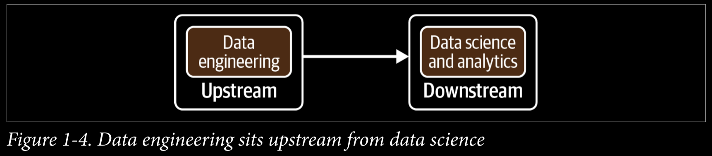
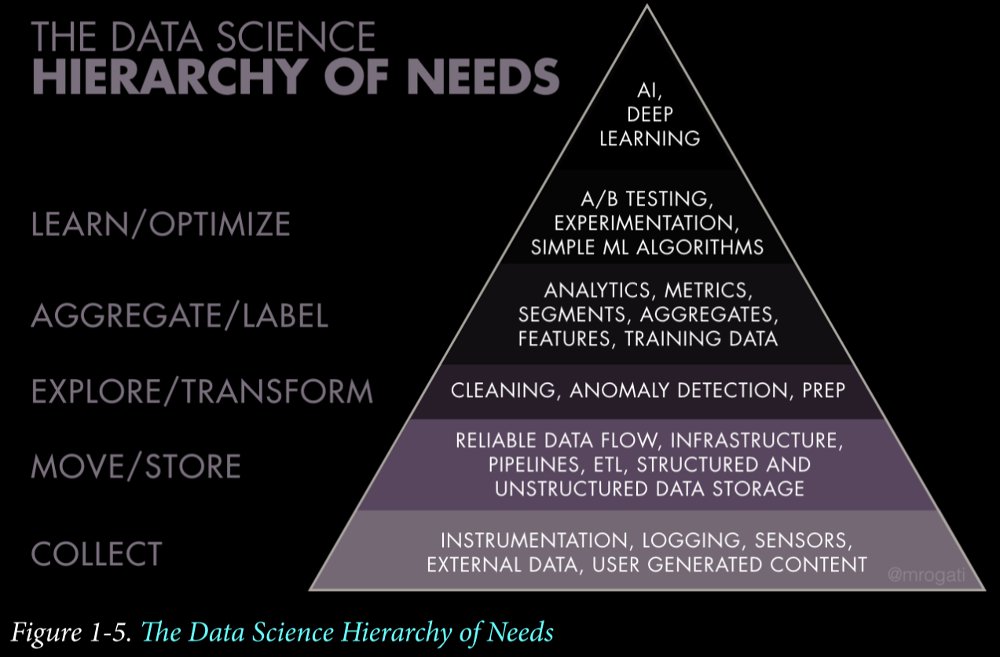
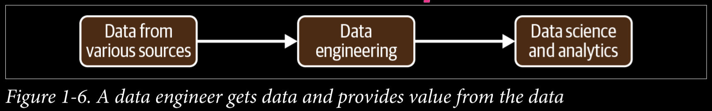
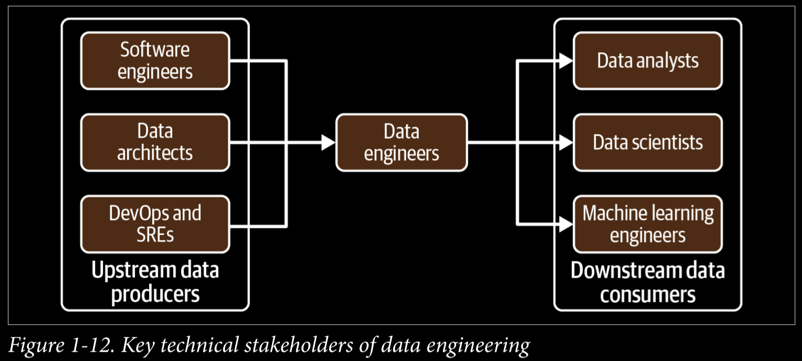

# ***Fundamentals of Data Engineering***

This book aims to fill a gap in current ***data engineering*** content and materials.

## ***Part 1:*** Foundations and Building Blocks

### ***Chapter 1:*** Data Engineering Described

Data Engineering builds the foundation for data science and analytics in production.

#### What is Data Engineering?

> **Data engineering** *is the development, implementation, and maintenance of systems and processes that take in raw data and produce high-quality, consistent information that supports downstream use cases, such as analysis and machine learning. Data engineering is the intersection of security, data management, DataOps, data architecture, orchestration, and software engineering.*

#### What is Data Engineer?

> *A* **data engineer** *manages the data engineering lifecycle, beginning with getting data from source systems and ending with serving data for use cases, such as analysis or machine learning*.

#### Data Engineering and Data Science

*Data engineering* sits *upstream* from data science (Figure 1-4), meaning *data engineers* provide the inputs used by *data scientists* (downstream from data engineering), who convert these inputs into something **useful**.

Consider the ***Data Science Hierarchy of Needs*** (Figure 1-5).

*Rogati* argues that companies need to build a *solid data foundation* (the bottom three levels of the hierarchy) before tackling areas such as **AI and ML**. When *data engineers* focus on these bottom parts of the *hierarchy*, they build a solid foundation for *data scientists* to succeed.

With *data science* driving advanced analytics and ML, *data engineering* straddles the divide between **getting data and getting value** from data (see Figure 1-6).

#### Data Engineering Skills and Activities

1. ***Understanding*** *of how to evaluate data tools and how they fit together across the data engineering lifecycle*.
2. ***Know*** *how data is produced in source systems and how analysts and data scientists will consume and create value after processing and curating data*.
3. ***Optimize*** *along the axes of cost, agility, scalability, simplicity, reuse, and interoperability* (Figure 1-7).

> *Data engineers are now* **focused** *on balancing the simplest and most cost-effective, best-of-breed services that deliver value to the business. The data engineer is also expected to* **create** *agile data architectures that evolve as new trends emerge*.

A data engineer should have a ***good functioning understanding*** of next areas to serve **stakeholders** best.

- *ML models*
- *Reports or dashboards*
- *Data analysis*
- *Key performance indicators (KPIs)*
- *Software applications*

#### Data Maturity and the Data Engineer

***Data maturity*** *is the progression toward higher data utilization, capabilities, and integration across the organization*, but data maturity does not simply depend on the age or revenue of a company. What matters is the way data is leveraged as a competitive advantage. 

> *An early-stage startup can have greater data maturity than a 100-year-old company with annual revenues in the billions*

Our *data maturity model* (Figure 1-8) has three stages: **starting with data, scaling with data, and leading with data**.

A *data engineer* should focus on the following:

1. **Starting with Data**
    - ***Get buy-in*** from key *stakeholders*, including executive management.
    - Define the right ***data architecture***.
    - ***Identify and audit data*** that will support *key initiatives* and operate within the *data architecture* you designed.
    - ***Build a solid data foundation*** for future data analysts and data scientists to generate reports and models that provide competitive value.
2. **Scaling with Data**
    - Establish ***formal data practices***.
    - Create ***scalable and robust*** data architectures.
    - Adopt ***DevOps and DataOps*** practices.
    - Build systems that ***support ML***.
    - Customize ***only when*** a competitive advantage results.
3. **Leading with Data**
    - Create automation for the ***seamless introduction and usage of new data***.
    - Focus on building custom tools and systems that ***leverage data as a competitive advantage***.
    - Focus on the “enterprisey” aspects of data, such as ***data management and DataOps***.
    - Deploy tools that ***expose and disseminate data*** throughout the organization.
    - ***Collaborate efficiently*** with software engineers, ML engineers, analysts, and others.
    - ***Create a community*** and environment where people can collaborate and speak openly.

#### The Background and Skills of a Data Engineer

With respect to data, this entails knowing about various ***best practices*** around data management. On the technology end, a data engineer must be ***aware of various options*** for tools, **their interplay, and their trade-offs**. *Data engineering* is a **holistic practice**; the best data engineers view their responsibilities through ***business and technical lenses***.

> *Everyone entering the field should expect to invest a significant amount of time in* **self-study**.

#### Business Responsibilities

1. ***Know how to communicate*** with nontechnical and technical people.
    - We suggest ***paying close attention*** to organizational hierarchies, who reports to whom, how people interact, and which silos exist.
2. ***Understand how to scope and gather*** business and product requirements.
    - In addition, develop a ***sense of how data and technology*** decisions impact the business.
3. ***Understand the cultural foundations*** of Agile, DevOps, and DataOps.
    - Agile, DevOps, and DataOps are ***fundamentally cultural***, requiring buy-in across the organization.
4. ***Learn continuously***.
    - People who succeed in it are great at ***picking up new things*** while sharpening their fundamental knowledge.
    - Stay abreast of the field and ***learn how to learn***.

> *Knowing how to navigate an organization, scope and gather requirements, control costs, and continuously learn* **will set you apart** *from the data engineers who rely solely on their technical abilities to carry their career.*

#### Technical Responsibilities

You must understand ***how to build architectures*** that ***optimize performance and cost*** at a high level, using prepackaged or homegrown components. Ultimately, architectures and constituent technologies are building blocks to serve the *data engineering lifecycle*.

> *A data engineer should have production-grade software engineering chops.*

Even in a more abstract world, ***software engineering best practices*** provide a competitive advantage, and data engineers who can dive into the deep architectural details of a codebase give their companies an edge when specific technical needs arise.

***Data engineering programming languages:***

1. ***SQL***
    - The most common interface for ***databases and data lakes***.
2. ***Python***
    - The bridge language between ***data engineering and data science***.
3. ***JVM***
    - Understanding Java or ***Scala*** will be beneficial if you’re using a popular open source data framework.
4. ***bash***
    - The ***command-line interface*** for Linux operating systems.
    - If you’re using ***Windows***, feel free to substitute ***PowerShell*** for bash.

#### The Continuum of Data Engineering Roles, from A to B

1. ***Type A data engineers***
    - A stands for ***abstraction***.
    - Data engineer avoids undifferentiated heavy lifting, keeping data architecture as abstract and straightforward as possible and ***not reinventing the wheel***.
    - Type A data engineers manage the data engineering lifecycle mainly by using entirely ***off-the-shelf products, managed services, and tools***.
2. ***Type B data engineers***
    - B stands for ***build***.
    - Type B data engineers ***build data tools and systems*** that scale and leverage a company’s core competency and competitive advantage.

> *Type A and type B data engineers may work in the same company and may even be the same person!*

#### Data Engineers Inside an Organization

Depending on what they’re working on, they will interact with ***technical and nontechnical*** people and face different directions
(internal and external).

#### Internal-Facing Versus External-Facing Data Engineers

A data engineer serves several end users and faces many ***internal and external*** directions (Figure 1-9).

An ***external-facing data engineer*** *typically aligns with the users of external-facing applications, such as social media apps, Internet of Things (IoT) devices, and ecommerce platforms*. The systems built by these data engineers have a ***feedback loop*** from the application to the data pipeline, and then back to the application (Figure 1-10).

***External-facing query engines*** often handle much larger ***concurrency*** loads than *internal-facing systems*. In addition, ***security*** is a much more ***complex and sensitive*** problem for external queries, especially if the data being queried is ***multi-tenant*** *(data from many customers and housed in a single table)*.

An ***internal-facing data engineer*** typically focuses on activities crucial to the ***needs of the business and internal stakeholders*** (Figure 1-11). Examples include creating and maintaining *data pipelines and data warehouses for BI dashboards, reports, business processes, data science, and ML models*.

> *In practice, internal-facing data is usually a prerequisite to external-facing data.*

#### Data Engineers and Other Technical Roles

*Data engineers* sit at the nexus of various roles, directly or through managers, interacting with many organizational units. In this section, we’ll discuss technical roles connected to data engineering (Figure 1-12).

### ***Chapter 2:*** Data Engineering Lifecycle

