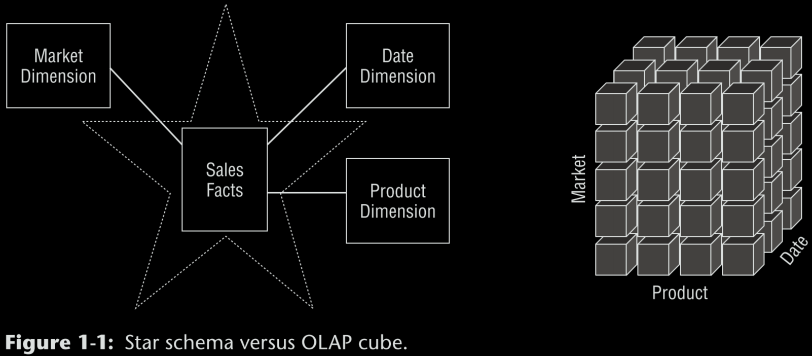
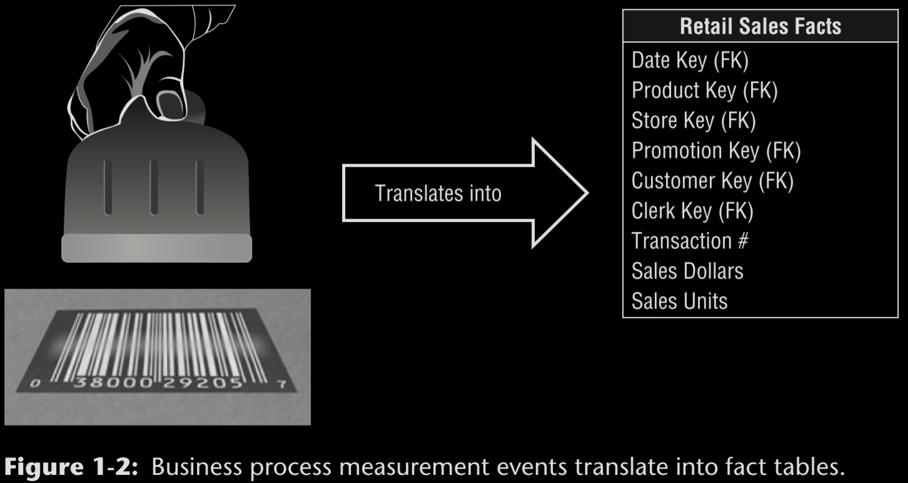
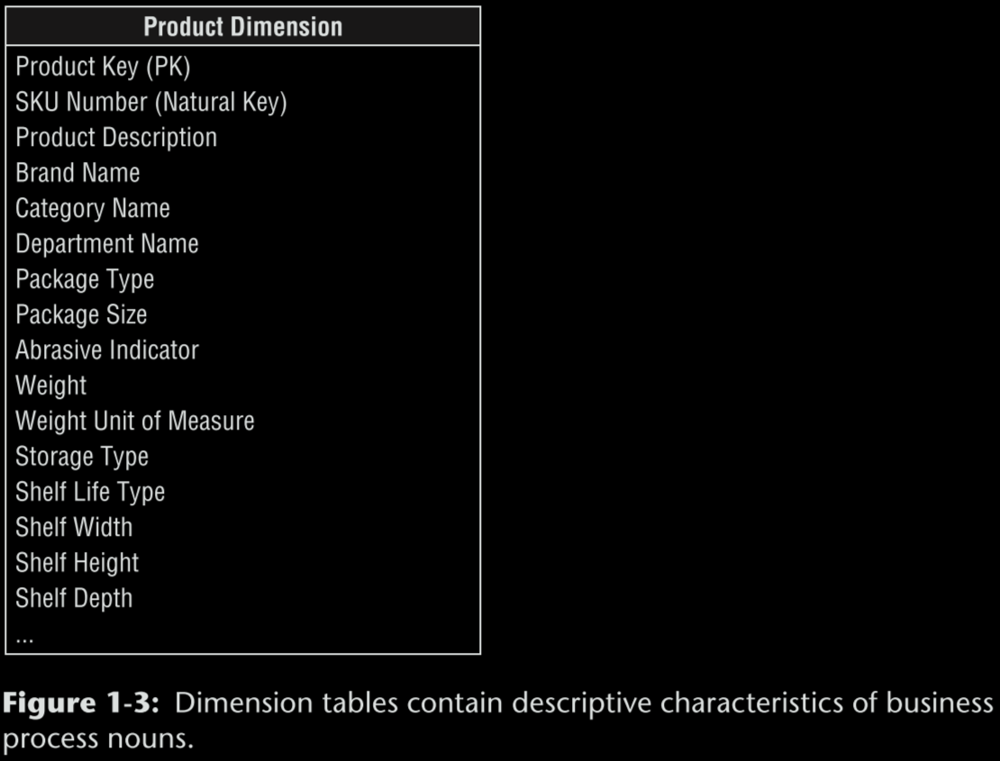
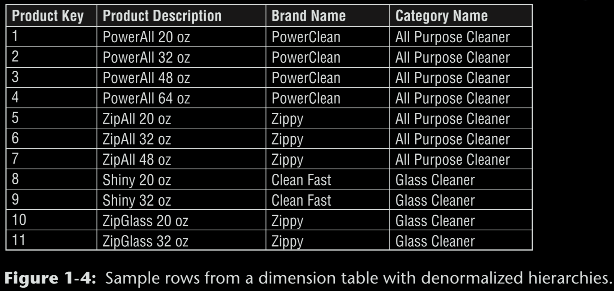
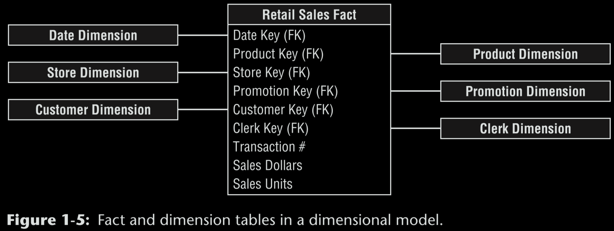
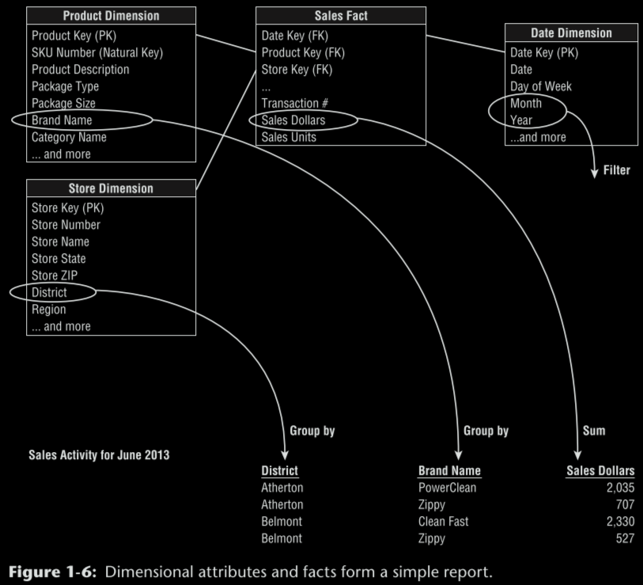
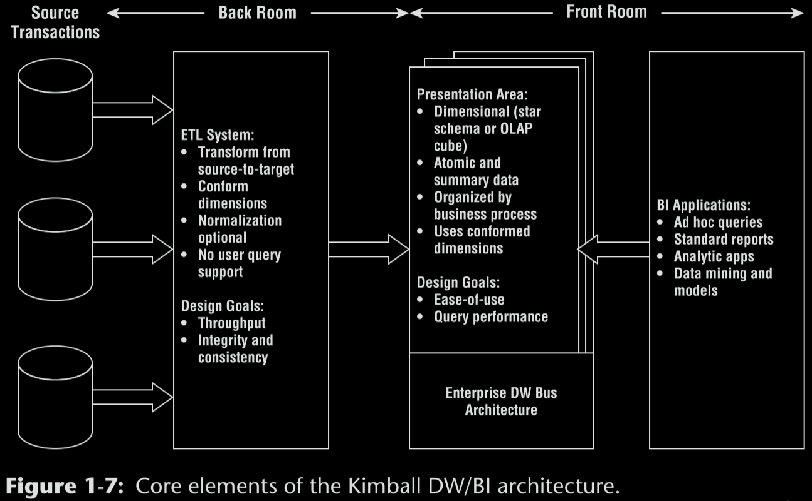
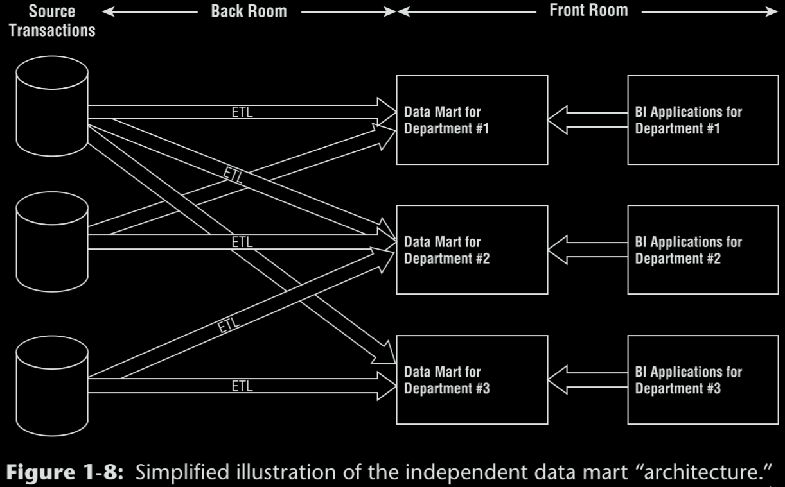
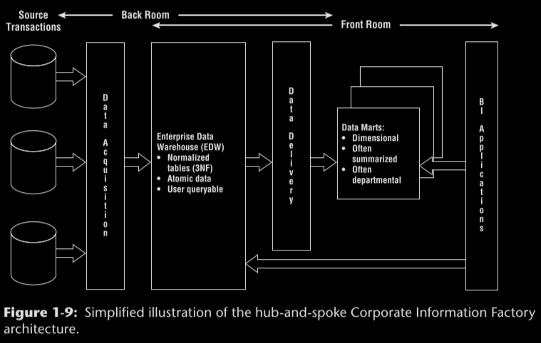
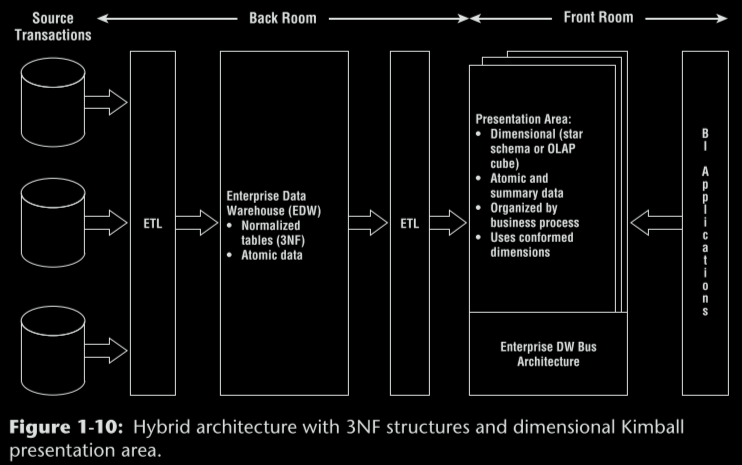

# The Data Warehouse Toolkit

Reading notes from *The Data Warehouse Toolkit* by Ralph Kimball and Margy Ross. The next [guide](https://www.holistics.io/blog/how-to-read-data-warehouse-toolkit/) for reading the book its used. 

## Data Warehousing, Business Intelligence, and Dimensional Modeling Primer

We begin by considering data warehousing and business intelligence (DW/BI) systems from a high-level perspective.

### Different Worlds of Data Capture and Data Analysis

Simply speaking, the operational systems are where you put the data in, and the DW/BI system is where you get the data out.

### Goals of Data Warehousing and Business Intelligence

1. The DW/BI system must make information easily accessible.
2. The DW/BI system must present information consistently.
3. The DW/BI system must adapt to change.
4. The DW/BI system must present information in a timely way.
5. The DW/BI system must be a secure bastion that protects the information assets.
6. The DW/BI system must serve as the authoritative and trustworthy foundation for improved decision making.
7. The business community must accept the DW/BI system to deem it successful.

Although each requirement on this list is important, the final two are the most critical, and unfortunately, often the most overlooked.

### Dimensional Modeling Introduction

Dimensional modeling is widely accepted as the preferred technique for presenting analytic data because it addresses two simultaneous requirements:

1. Deliver data that’s understandable to the business users.
2. Deliver fast query performance.

Dimensional modeling is a longstanding technique for making databases simple.

A model that starts complicated surely will be overly complicated at the end, resulting in slow query performance and business user rejection.

Although dimensional models are often instantiated in relational database management systems, they are quite different from third normal form (3NF) models which seek to remove data redundancies. Normalized 3NF structures divide data into many discrete entities, each of which becomes a relational table. The industry sometimes refers to 3NF models as entity-relationship (ER) models. Entity-relationship diagrams (ER diagrams or ERDs) are drawings that communicate the relationships between tables. The key difference between 3NF and dimensional models is the degree of normalization. Normalized 3NF structures are immensely useful in operational processing because an update or insert transaction touches the database in only one place. Normalized models, however, are too complicated for BI queries.

Likewise, most relational database management systems can’t efficiently query a normalized model. The use of normalized modeling in the DW/BI presentation area defeats the intuitive and high-performance retrieval of data.

> A dimensional model contains the same information as a normalized model, but packages the data in a format that delivers user understandability, query performance, and resilience to change.

#### Star Schemas Versus OLAP Cubes

Dimensional models implemented in relational database management systems are referred to as star schemas because of their resemblance to a star-like structure. Dimensional models implemented in multidimensional database environments are referred to as online analytical processing (OLAP) cubes, as illustrated in Figure 1-1.

Consequently, cubes deliver superior query performance because of the precalculations, indexing strategies, and other optimizations. Although the capabilities of OLAP technology are continuously improving, we generally recommend that detailed, atomic information be loaded into a star schema; optional OLAP cubes are then populated from the star schema.

##### OLAP Deployment Considerations

1. A star schema hosted in a relational database is a good physical foundation for building an OLAP cube.
2. OLAP cubes have traditionally been noted for extreme performance advantages over RDBMSs.
3. OLAP cube data structures are more variable across different vendors than relational DBMSs
4. OLAP cubes typically offer more sophisticated security options than RDBMSs.
5. OLAP cubes offer significantly richer analysis capabilities than RDBMSs.
6. OLAP cubes gracefully support slowly changing dimension type 2 changes.
7. OLAP cubes gracefully support transaction and periodic snapshot fact tables.
8. OLAP cubes typically support complex ragged hierarchies of indeterminate depth.
9. OLAP cubes may impose detailed constraints on the structure of dimension keys.
10. Some OLAP products do not enable dimensional roles or aliases.

#### Fact Tables for Measurements

The fact table in a dimensional model stores the performance measurements resulting from an organization’s business process events. The term fact represents a business measure. Each row in a fact table corresponds to a measurement event. One of the core tenets of dimensional modeling is that all the measurement rows in a fact table must be at the same grain.

> The idea that a measurement event in the physical world has a one-to-one relationship to a single row in the corresponding fact table is a bedrock principle for dimensional modeling.

Additivity is crucial because BI applications rarely retrieve a single fact table row. Semi-additive facts, such as account balances, cannot be summed across the time dimension. Non-additive facts, such as unit prices, can never be added.

Facts are often described as continuously valued to help sort out what is a fact versus a dimension attribute. It is important that you do not try to fill the fact table with zeros representing no activity because these zeros would overwhelm most fact tables. Fact tables tend to be deep in terms of the number of rows, but narrow in terms of the number of columns. Transaction grain fact tables are the most common.

All fact tables have two or more foreign keys (refer to the FK notation in Figure 1-2) that connect to the dimension tables’ primary keys. When all the keys in the fact table correctly match their respective primary keys in the corresponding dimension tables, the tables satisfy referential integrity. The fact table generally has its own primary key composed of a subset of the foreign keys. This key is often called a composite key. Every table that has a composite key is a fact table. Fact tables express many-to-many relationships. All others are dimension tables.

#### Dimension Tables for Descriptive Context

- Are integral companions to a fact table.
- Contain the textual context associated with a business process measurement event.
- Tend to have fewer rows than fact tables, but can be wide with many large text columns.

In a query or report request, attributes are identified as the by words. Attributes should consist of real words rather than cryptic abbreviations. Sometimes operational codes or identifiers have legitimate business significance to users or are required to communicate back to the operational world.

In many ways, the data warehouse is only as good as the dimension attributes; the analytic power of the DW/BI environment is directly proportional to the quality and depth of the dimension attributes.

> Dimensions provide the entry points to the data, and the final labels and groupings on all DW/BI analyses.

When triaging operational source data, it is sometimes unclear whether a numeric data element is a fact or dimension attribute.

> The designer’s dilemma of whether a numeric quantity is a fact or a dimension attribute is rarely a difficult decision. Continuously valued numeric observations are almost always facts; discrete numeric observations drawn from a small list are almost always dimension attributes.

Instead of third normal form, dimension tables typically are highly denormalized with flattened many-to-one relationships within a single dimension table. You should almost always trade off dimension table space for simplicity and accessibility.

#### Facts and Dimensions Joined in a Star Schema

Each business process is represented by a dimensional model that consists of a fact table containing the event’s numeric measurements surrounded by a halo of dimension tables that contain the textual context that was true at the moment the event occurred.

We have observed literally hundreds of instances in which users immediately agree that the dimensional model is their
business. Database optimizers process these simple schemas with fewer joins more efficiently. Every dimension is equivalent; all dimensions are symmetrically equal entry points into the fact table.

With dimensional models, you can add completely new dimensions to the schema as long as a single value of that dimension is defined for each existing fact row. Likewise, you can add new facts to the fact table, assuming that the level of detail is consistent with the existing fact table.

### Kimball’s DW/BI Architecture

There are four separate and distinct components to consider in the DW/BI environment: operational source systems, ETL system, data presentation area, and business intelligence applications.

#### Operational Source Systems

These are the operational systems of record that capture the business’s transactions. Source systems maintain little historical data; a good data warehouse can relieve the source systems of much of the responsibility for representing the past.

#### Extract, Transformation, and Load System

The ETL system is everything between the operational source systems and the DW/BI presentation area.

1. Extracting means reading and understanding the source data and copying the data needed into the ETL system for further manipulation.
2. The ETL system adds value to the data with these cleansing and conforming tasks by changing the data and enhancing it.
3. The final step of the ETL process is the physical structuring and loading of data into the presentation area’s target dimensional models.

Many of these defined subsystems focus on dimension table processing, such as surrogate key assignments, code lookups to provide appropriate descriptions, splitting, or combining columns to present the appropriate data values, or joining underlying third normal form table structures
into flattened denormalized dimensions.

When the dimension and fact tables in a dimensional model have been updated, indexed, supplied with appropriate aggregates, and further quality assured, the business community is notified that the new data has been published.

In many cases, the ETL system is not based on relational technology but instead may rely on a system of flat files.

The creation of both normalized structures for the ETL and dimensional structures for presentation means that the data is potentially extracted, transformed, and loaded twice—once into the normalized database and then again when you load the dimensional model.

> It is acceptable to create a normalized database to support the ETL processes; however, this is not the end goal. The normalized structures must be off -limits to user queries because they defeat the twin goals of understandability and performance.

#### Presentation Area to Support Business Intelligence

The DW/BI presentation area is where data is organized, stored, and made available for direct querying by users, report writers, and other analytical BI applications. Fortunately, the industry has matured to the point where we’re no longer debating this approach; it has concluded that dimensional modeling is the most viable technique for delivering data to DW/BI users.

In other words, it is completely unacceptable to store only summary data in dimensional models while the atomic data is locked up in normalized models. The most finely grained data must be available in the presentation area so that users can ask the most precise questions possible.

Dimensional models should correspond to physical data capture events; they should not be designed to deliver the report-of-the-day. In other words, you should construct a single fact table for atomic sales metrics rather than populating separate similar, but slightly different, databases containing sales metrics for the sales, marketing, logistics, and finance teams.

When the bus architecture is used as a framework, you can develop the enterprise data warehouse in an agile, decentralized, realistically scoped, iterative manner.

> The data must not be structured according to individual departments’ interpretation of the data.

#### Business Intelligence Applications

The term BI application loosely refers to the range of capabilities provided to business users to leverage the presentation area for analytic decision making.

Most business users will likely access the data via prebuilt parameter-driven applications and templates that do not require users to construct queries directly. Some of the more sophisticated applications, such as modeling or forecasting tools, may upload results back into the operational source systems, ETL system, or presentation area.

> A properly designed DW/BI environment trades off work in the front room BI applications in favor of work in the back room ETL system. Front room work must be done over and over by business users, whereas back room work is done once by the ETL staff .

### Alternative DW/BI Architectures

Even more fortunate, there’s a role for dimensional modeling regardless of your architectural predisposition. The architecture should merely be a means to this objective.

#### Independent Data Mart Architecture

With this approach, analytic data is deployed on a departmental basis without concern to sharing and integrating information across the enterprise.

It’s extremely common for multiple departments to be interested in the same performance metrics resulting from an organization’s core business process events.

Of course, multiple uncoordinated extracts from the same operational sources and redundant storage of analytic data are inefficient and wasteful in the long run. We strongly discourage the independent data mart approach.

#### Hub-and-Spoke Corporate Information Factory Inmon Architecture

The hub-and-spoke Corporate Information Factory (CIF) approach is advocated by Bill Inmon and others in the industry.

> Normalization simply creates physical tables that implement many-to-one relationships. Integration, on the other hand, requires that inconsistencies arising from separate sources be resolved. The Kimball architecture based on conformed dimensions reverses this logic and focuses on resolving data inconsistencies without explicitly requiring normalization.

#### Hybrid Hub-and-Spoke and Kimball Architecture

The final architecture warranting discussion is the marriage of the Kimball and Inmon CIF architectures.

It may leverage a preexisting investment in an integrated repository, while addressing the performance and usability issues associated with the 3NF EDW by offloading queries to the dimensional presentation area.

If you have the appetite, the perceived need, and perhaps most important, the budget and organizational patience to fully normalize and instantiate your data before loading it into dimensional structures that are well designed according to the Kimball methods, go for it.

### Dimensional Modeling Myths

Despite the widespread acceptance of dimensional modeling, some misperceptions persist in the industry.

#### Myth 1: Dimensional Models are Only for Summary Data

Summary data should complement the granular detail solely to provide improved performance for common queries, but not replace the details.

#### Myth 2: Dimensional Models are Departmental, Not Enterprise

Rather than drawing boundaries based on organizational departments, dimensional models should be organized around business processes, such as orders, invoices, and service calls.

#### Myth 3: Dimensional Models are Not Scalable

The database vendors have wholeheartedly embraced DW/BI and continue to incorporate capabilities into their products to optimize dimensional models’ scalability and performance.

#### Myth 4: Dimensional Models are Only for Predictable Usage

Dimensional models should not be designed by focusing on predefined reports or analyses; the design should center on measurement processes.

The key is to focus on the organization’s measurement events that are typically stable, unlike analyses that are constantly evolving.

The secret to query flexibility is building fact tables at the most granular level.

Delivering dimensional models populated with the most detailed data possible ensures maximum flexibility and extensibility.

#### Myth 5: Dimensional Models Can’t Be Integrated

Dimensional models most certainly can be integrated if they conform to the enterprise data warehouse bus architecture.

Data integration depends on standardized labels, values, and definitions.

### More Reasons to Think Dimensionally

When gathering requirements for a DW/BI initiative, you need to listen for and then synthesize the findings around business processes. Instead you should constantly ask yourself about the business process measurement events producing
the report or dashboard metrics.

Although it’s critical that the DW/BI team concentrates on business processes, it’s equally important to get IT and business management on the same wavelength.

When prioritizing opportunities and developing the DW/ BI roadmap, business processes are the unit of work.

Working with business leadership partners, rank each business process on business value and feasibility, then tackle processes with the highest impact and feasibility scores first.

If tasked with drafting the DW/BI system’s data architecture, you need to wrap your head around the organization’s processes, along with the associated master descriptive dimension data.

Data stewardship or governance programs should focus fi rst on the major dimensions.

Thinking about the central nouns used to describe the business translates into a list of data governance eff orts to be led by subject matter experts from the business community.

Robust dimensions translate into robust DW/BI systems.

Dimensional modeling concepts link the business and technical communities together as they jointly design the DW/BI deliverables.

### Agile Considerations

Many of the core tenets of agile methodologies align with Kimball best practices, including:

1. Focus on delivering business value.
2. Value collaboration between the development team and business stakeholders.
3. Stress ongoing face-to-face communication, feedback, and prioritization with the business stakeholders.
4. Adapt quickly to inevitably evolving requirements.
5. Tackle development in an iterative, incremental manner.

The bus matrix provides a framework and master plan for agile development, plus identifies the reusable common descriptive dimensions that provide both data consistency and reduced time-to-market delivery.

Incremental development work can produce components of the framework until sufficient functionality is available and then
released to the business community.

We argue that conformed dimensions enable agile DW/BI development, along with agile decision making.

The time-to-market for a new business process data source shrinks as developers reuse existing conformed dimensions.

Without a framework like the enterprise data warehouse bus matrix, some DW/ BI teams have fallen into the trap of using agile techniques to create analytic or reporting solutions in a vacuum.

We encourage agility, when appropriate, however building isolated data sets should be avoided.
