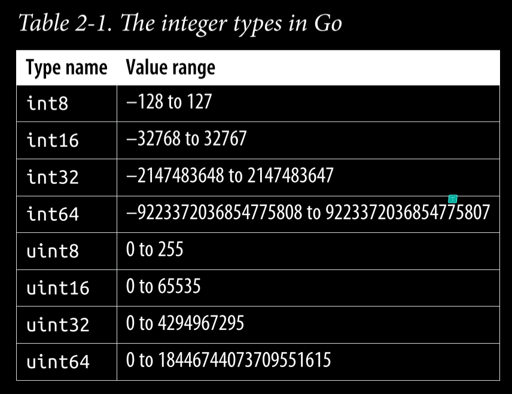
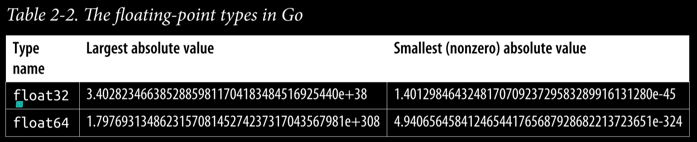

# Predeclared Types and Declarations

While every programmer has experience with these concepts, Go does some things differently, and subtle differences exist between Go and other languages.

## The Predeclared Types

Go has many types built into the language. These are called ***predeclared types***. They are similar to types that are found in other languages: *booleans, integers, floats, and strings*.

### The Zero Value

Go, like most modern languages, assigns a default ***zero value*** to any variable that is declared but not assigned a value.

### Literals

A ***Go literal*** is an explicitly specified number, character, or string.

An ***integer literal*** is a sequence of numbers. Integer literals are base 10 by default, but different prefixes are used to indicate other bases: 0b for binary (base 2), 0o for octal (base 8), or 0x for hexadecimal (base 16).

A ***floating-point literal*** has a decimal point to indicate the fractional portion of the value. They can also have an exponent specified with the letter e and a positive or negative number (such as 6.03e23).

A ***rune literal*** represents a character and is surrounded by single quotes. Unlike many other languages, in Go ***single quotes and double quotes are not interchangeable***.

There are two ways to indicate ***string literals***. Most of the time, you should use double quotes to create an interpreted string literal (e.g., type *"Greetings and Salutations"*).

If you need to include backslashes, double quotes, or newlines in your string, using a ***raw string literal*** is easier. These are delimited with ***backquotes (`)*** and can contain any character except a backquote.

***Literals*** are considered untyped. Go uses the default type for a literal; if there's nothing in the expression that makes clear what the type of the literal is, the literal defaults to a type.

### Booleans

Variables of ***bool*** type can have one of two values: *true* or *false*. The zero value for a ***bool*** is *false*.

```go
var flag bool // no value assigned, set to false
var isAwesome = true
```

### Numeric Types

Go has a large number of numeric types: 12 types (and a few special names) that are grouped into three categories.

#### Integers types

Go provides both signed and unsigned integers in a variety of sizes, from one to eight bytes.



It might be obvious from the name, but the *zero value* for all of the integer types is 0.

#### The special integer types

A ***byte*** is an alias for *uint8*; it is legal to assign, compare, or perform mathematical operations between a *byte* and a *uint8*.

The second special name is *int*. Integer literals default to being of *int* type.

The third special name is *uint*. It follows the same rules as *int*, only it is unsigned (the values are always 0 or positive).

#### Integer operators

Go integers support the usual arithmetic operators: *+, -, *, /, with % for modulus.*

You can combine any of the arithmetic operators with = to modify a variable: *+=, -=, *=, /=, and %=.*

```go
var x int = 10
x *= 2 // x is now 20
```

You compare integers with *==, !=, >, >=, <, and <=.*

You can bit shift left and right with << and >>, or do bit masks with *& (bitwise AND), | (bitwise OR), ^ (bitwise XOR), and &^ (bitwise AND NOT)*. As with the arithmetic operators, you can also combine all the bitwise operators with = to modify a variable: *&=, |=, ^=, &^=, <<=, and >>=*.

#### Floating-point types

Go has two floating-point types: *float32* and *float64*. 



The zero value for both is 0.0.

Floating-point literals have a default type of *float64*, so always using *float64* is the simplest option.

> *Don't worry about the difference in memory size unless you have used the profiler to determine that it is a significant source of problems.*

Dividing a nonzero floating-point variable by 0 returns *+Inf or -Inf (positive or negative infinity)*, depending on the sign of the number. Dividing a floating-point variable set
to 0 by 0 returns *NaN (Not a Number)*.

### A Taste of Strings and Runes

Like most modern languages, Go includes *strings* as a built-in type. The zero value for a *string* is the *empty string*.

Like *integers* and *floats*, *strings* are compared for equality using *==*, difference with *!=*, or ordering with *>, >=, <, or <=*. They are concatenated by using the *+* operator.

Strings in Go are ***immutable***; you can reassign the value of a string variable, but *you cannot change the value of the string that is assigned to it*.

The *rune* type is an alias for the *int32* type, just as *byte* is an alias for *uint8*. As you could probably guess, a *rune* literal's default type is a *rune*, and a *string* literal's default type is a *string*.

If you are referring to a *character*, use the *rune* type, not the *int32* type.

```go
var myFirstInitial rune = 'A' // good - the type name matches the usage
var myLastInitial int32 = 'B' // bad - legal but confusing
```

### Explicit Type Conversion

As a language that values *clarity of intent and readability*, Go doesn't allow ***automatic type promotion*** between variables. You must use a type conversion when variable types do not match. Even different-sized *integers and floats* must be converted to the same type to interact.

```go
var x int = 10
var y float64 = 20.0
var sum1 float64 = float64(x) + y
var sum2 int = x + int(y)
```

In fact, ***no*** other type can be converted to a *bool*, implicitly or explicitly. If you want to convert from another data type to *boolean*, you must use one of the comparison operators(*==, !=, >, <, <=, or >=*).

> *Type conversions are one of the places where Go chooses to add a little verbosity in exchange for a great deal of simplicity and clarity.*

### Literals are Untyped

Go lets you use an integer literal in floating-point expressions or even assign an integer literal to a floating-point variable.

```go
var x float64 = 10
var y float64 = 20.3 * 5
```

Go is a practical language, and it makes sense to ***avoid forcing*** a type until the developer specifies one. Being untyped goes only so far; you ***can't*** assign a literal string to a variable with a numeric type or a literal number to a string variable, ***nor*** can you assign a float literal to an int.

## var VS :=

Each declaration style ***communicates*** something about how the variable is used.

The most verbose way to declare a variable in Go uses the ***var*** keyword, an explicit type, and an assignment:

```go
var x int = 10
```

If the type on the righthand side of the = is the ***expected type*** of your variable, you can leave off the type from the left side of the =:

```go
var x = 10
```

Conversely, if you want to declare a variable and ***assign it the zero value***, you can keep the type and drop the = on the righthand side:

```go
var x int
```

You can declare ***multiple variables*** at once with var, and they can be of the same type:

```go
var x, y int = 10, 20
```

You can declare ***all zero values*** of the same type:

```go
var x, y int
```

or of ***different types***:

```go
var x, y = 10, "hello"
```

If you are declaring multiple variables at once, you can wrap them in a ***declaration list***:

```go
var (
    x   int
    y   int = 20
    z   int = 30
    d, e    = 40, "hello"
    f, g string
)
```

Go also supports a ***short declaration and assignment format***. When you are within a function, you can use the ***:=*** operator to replace a var declaration that uses ***type inference***:

```go
var x = 10
x := 10
```

As with var, you can declare ***multiple variables*** at once using :=:

```go
var x, y = 10, "hello"
x, y := 10, "hello"
```

The := operator can do one trick that you cannot do with var: it allows you to ***assign values to existing variables too***.

```go
x := 10
x, y := 20, "hello"
```

If you are declaring a variable at the ***package level***, you must use var because := is ***not legal*** outside of functions.

The ***most common*** declaration style within functions is :=. Outside of a function, use ***declaration lists*** on the rare occasions when you are declaring multiple ***package-level*** variables.

While ***var and :=*** allow you to declare multiple variables on the same line, use this style only when assigning multiple ***values returned*** from a function or the ***comma ok idiom***.

As a general rule, you should only declare variables in the ***package block*** that are effectively ***immutable***.

## Using const

Many languages have a way to declare a value as ***immutable***. In Go, this is done with the ***const*** keyword.

```go
const x = 10
```

***Constants*** in Go are a way to give names to literals. Go doesn't provide a way to specify that a value calculated at ***runtime*** is immutable.

```go
x := 10
y := 20
const z = x + y // this won't compile!
```

## Typed and Untyped Constants

An ***untyped constant*** works exactly like a literal; it has no type of its own but does ***have a default type*** that is used when no other type can be inferred. A ***typed constant*** can be directly assigned ***only*** to a variable of that type.

In general, leaving a constant ***untyped*** gives you more flexibility. In certain situations, you'll want a constant to enforce a type.

```go
const x = 10 // untyped constant declared

var y int = x // this is legal
var z float64 = x // this is legal
var d byte = x // this is legal

const typedX int = 10 // typed constant declared
```

## Unused Variables

Another Go requirement is that every declared local variable ***must be read***. It is a compile-time error to declare a local variable and to not read its value.

As long as a variable is read ***once***, the compiler won't complain, even if there are writes to the variable that are never read.

```go
func main() {
    x := 10 // this assignment isn't read!
    x = 20
    fmt.Println(x)
    x = 30 // this assignment isn't read!
}
```

> *The Go compiler won't stop you from creating unread package level variables. This is one more reason you should avoid creating package-level variables.*

Perhaps surprisingly, the Go compiler allows you to create ***unread constants*** with **const**. This is because constants in Go ***are calculated at compile time*** and cannot have any side effects.

## Naming Variables and Constants

Like most languages, Go requires ***identifier names*** to start with a letter or underscore, and the name can contain numbers, underscores, and letters. ***Any*** Unicode character considered a letter or digit is allowed.

Instead, idiomatic Go uses ***camel case*** when an identifier name consists of multiple words.

```go
var indexCounter int
var numberTries int
```

> *The smaller the scope for a variable, the shorter the name that's used for it.*

When naming variables and constants in the *package block*, use more *descriptive* names.
